---
## Front matter
lang: ru-RU
title: Лабораторная работа №1
author:
  - Исаев Р. К.
institute:
  - Российский университет дружбы народов, Москва, Россия
  

## i18n babel
babel-lang: russian
babel-otherlangs: english

## Formatting pdf
toc: false
toc-title: Содержание
slide_level: 2
aspectratio: 169
section-titles: true
theme: metropolis
header-includes:
 - \metroset{progressbar=frametitle,sectionpage=progressbar,numbering=fraction}
---

# Информация

## Докладчик

:::::::::::::: {.columns align=center}
::: {.column width="70%"}

  * Исаев Рамазан Курбанович
  * студент НКАБД 01-24
  * Российский университет дружбы народов
  * <https://github.com/aksa077/study_2024-2025_os-intro.git>

:::
::: {.column width="30%"}

:::
::::::::::::::

## Цель

Целью данной работы является приобретение практических навыков установки операционной системы на виртуальную машину, настройки минимально необходимых для дальнейшей работы сервисов.

## Задачи

1) Запуск parallels desktop и создание виртуальной машины (операционная система linux fedora)

2) Настройка установки ОС

3) Перезапуск виртуальной машины и установка драйверов для parallels desktop

4) Подключение образа диска дополнений гостевой ОС

5) Установка необходимого ПО для создания документации 

## Теоретическое введение

Операционная система - это комплекс взаимосвязанных программ, который действует как интерфейс между приложениями и пользователями с одной стороны и аппаратурой компьютера с другой стороны. VirtualBox - это специальное средство для виртуализации, позволяющее запускать операционную систему внтури другой. С помощью VirtualBox мы можем также настраивать сеть, обмениваться файлами и делать многое другое.

# Выполнение лабораторной работы

## Создание виртуальной машины

Создаем новую виртуальную машину, указываем имя.

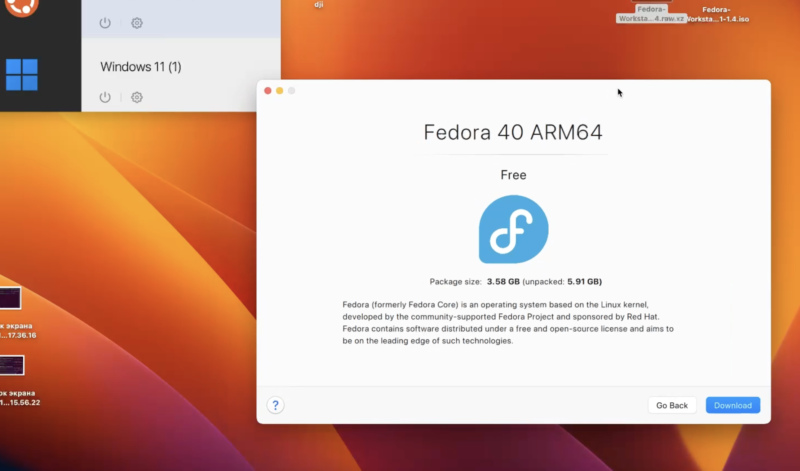{#fig:001 width=70%}

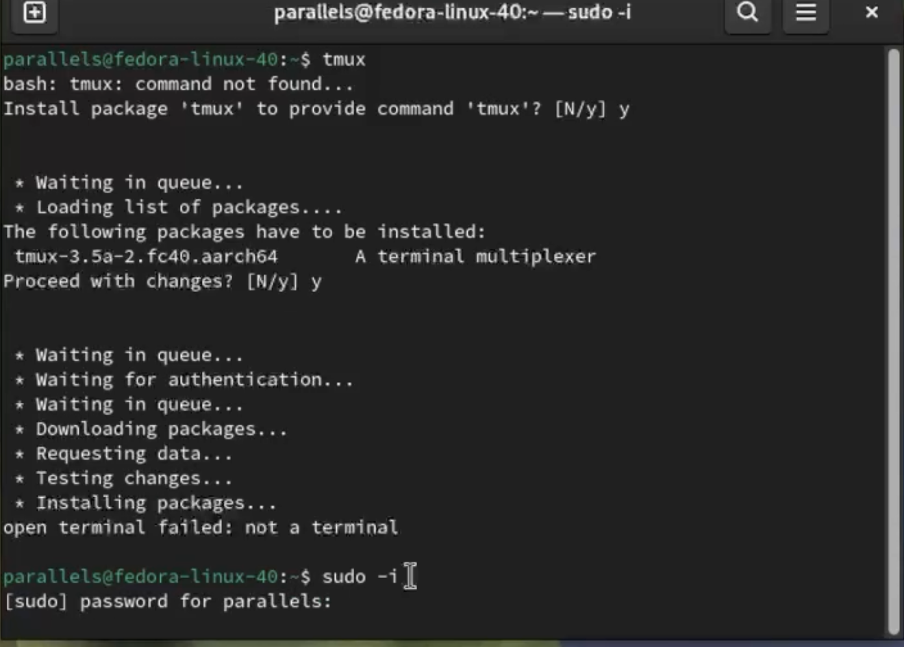 {#fig:002 width=70%}

## Обновления 

Входим в ОС под своей учетной записью.

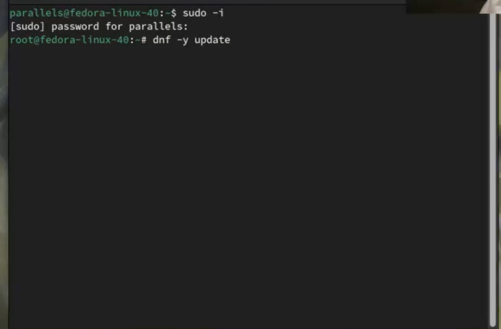 {#fig:003 width=70%}

## Повышение комфорта 

Вводим команду

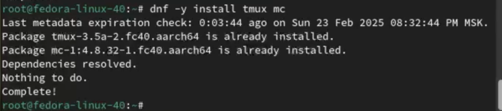 {#fig:004 width=70%}

## Отключение SElinux

Выполняем через mc

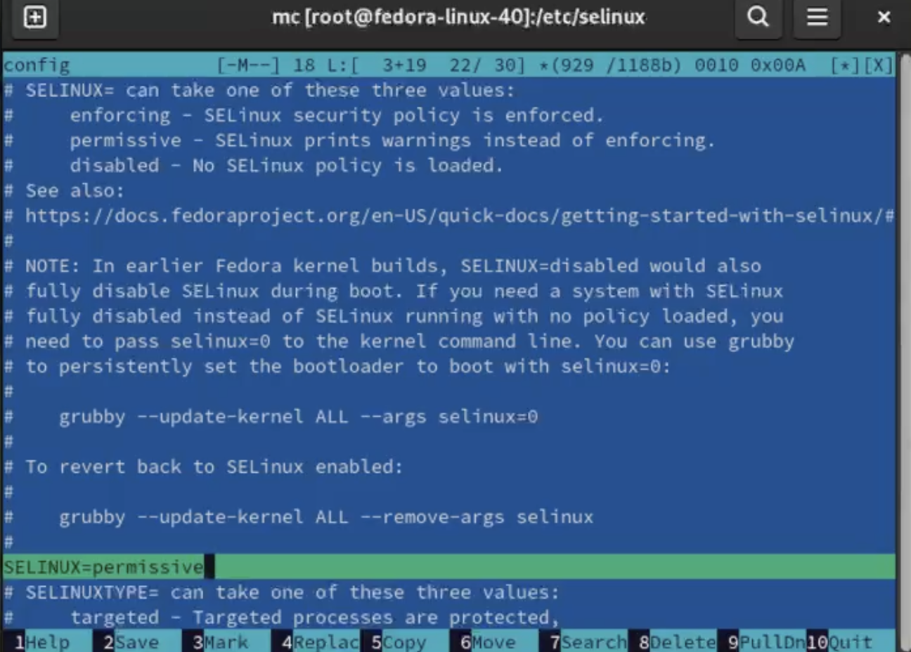 {#fig:005 width=70%}

## Настройка раскладки клавиатуры

Создаем конфигурационный файл

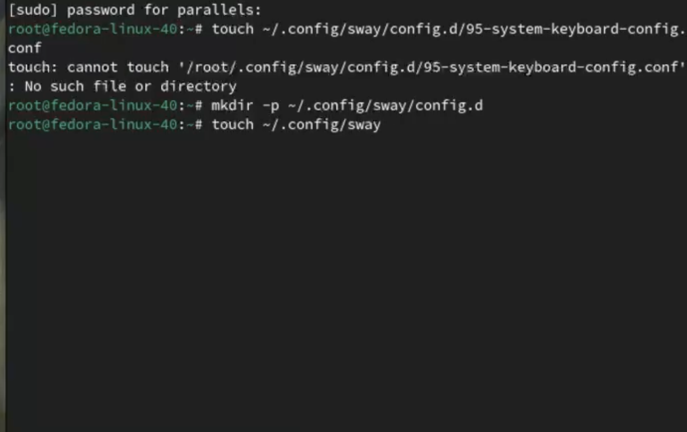 {#fig:006 width=70%}

## Установка имени пользователя

.

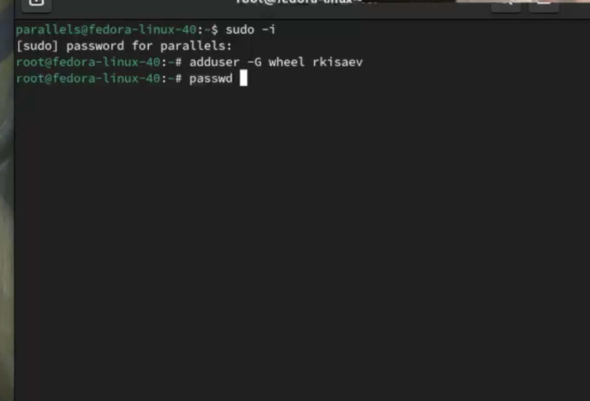 {#fig:009 width=70%}

## Работа с языком разметки Markdown

Установка с помощью менеджера пакетов

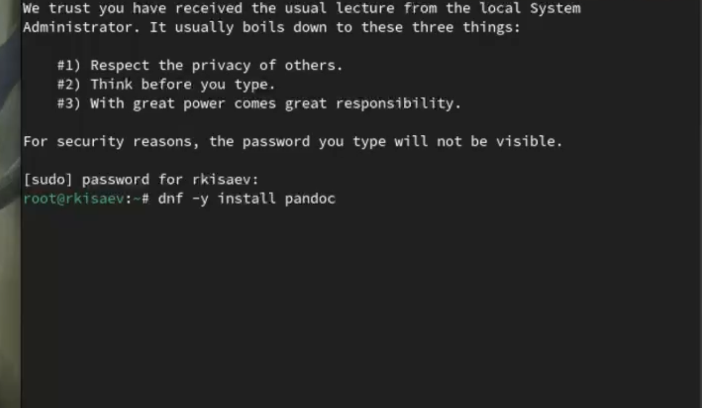 {#fig:010 width=70%}

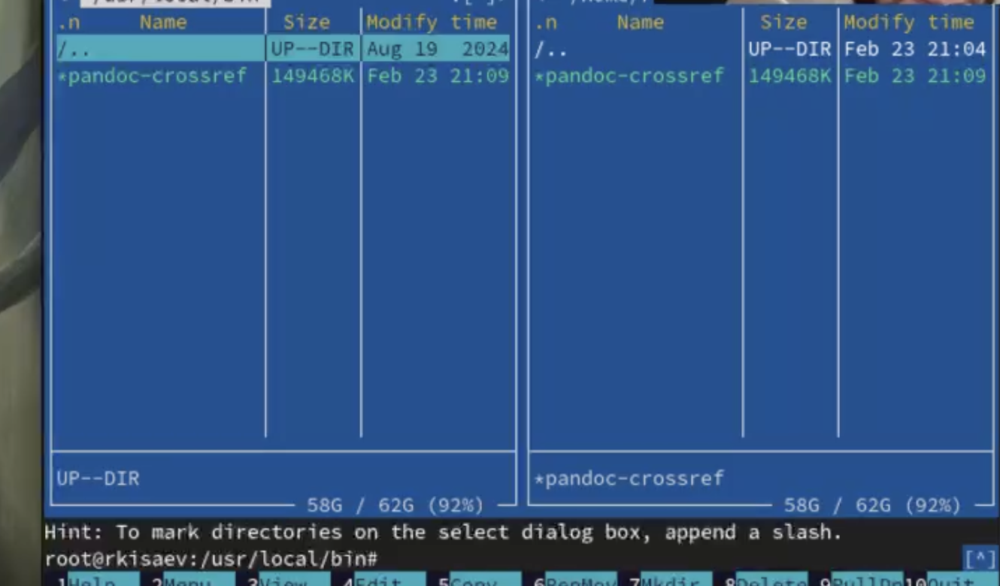 {#fig:011 width=70%}

## texlive

Установил texlive

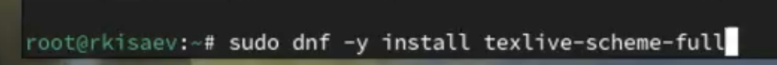 {#fig:011 width=70%}

## Домашнее задание

Получаем информацию о версии ядра Linux, частоте процессора, модели процессора, объеме доступной оперативной памяти, типе обнаруженного гипервизора.

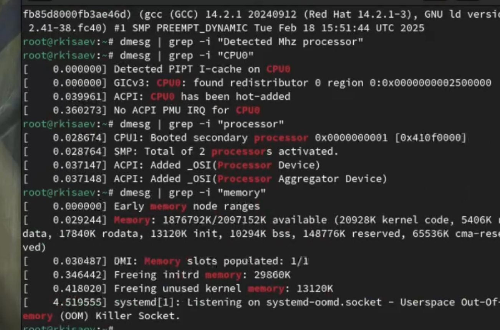 {#fig:013 width=70%}

# Вывод

В результате выполнения лабораторной работы были приобретены навыки установки операционной системы на виртуальную машину, а также настройки минимально необходимых для дальнейшей работы сервисов.
