---
## Front matter
title: "Отчет по лаборатной работе №1"
author: "Исаев Рамазан Курбанович "

## Generic otions
lang: ru-RU
toc-title: "Содержание"

## Bibliography
bibliography: bib/cite.bib
csl: pandoc/csl/gost-r-7-0-5-2008-numeric.csl

## Pdf output format
toc: true # Table of contents
toc-depth: 2
lof: true # List of figures
lot: true # List of tables
fontsize: 12pt
linestretch: 1.5
papersize: a4
documentclass: scrreprt
## I18n polyglossia
polyglossia-lang:
  name: russian
  options:
	- spelling=modern
	- babelshorthands=true
polyglossia-otherlangs:
  name: english
## I18n babel
babel-lang: russian
babel-otherlangs: english
## Fonts
mainfont: IBM Plex Serif
romanfont: IBM Plex Serif
sansfont: IBM Plex Sans
monofont: IBM Plex Mono
mathfont: STIX Two Math
mainfontoptions: Ligatures=Common,Ligatures=TeX,Scale=0.94
romanfontoptions: Ligatures=Common,Ligatures=TeX,Scale=0.94
sansfontoptions: Ligatures=Common,Ligatures=TeX,Scale=MatchLowercase,Scale=0.94
monofontoptions: Scale=MatchLowercase,Scale=0.94,FakeStretch=0.9
mathfontoptions:
## Biblatex
biblatex: true
biblio-style: "gost-numeric"
biblatexoptions:
  - parentracker=true
  - backend=biber
  - hyperref=auto
  - language=auto
  - autolang=other*
  - citestyle=gost-numeric
## Pandoc-crossref LaTeX customization
figureTitle: "Рис."
tableTitle: "Таблица"
listingTitle: "Листинг"
lofTitle: "Список иллюстраций"
lotTitle: "Список таблиц"
lolTitle: "Листинги"
## Misc options
indent: true
header-includes:
  - \usepackage{indentfirst}
  - \usepackage{float} # keep figures where there are in the text
  - \floatplacement{figure}{H} # keep figures where there are in the text
---

# Цель работы
Целью данной работы является приобретение практических навыков установки операционной системы на виртуальную машиную, настройки минимально необходимых для дальнейшей работы сервисов.

# Задание

1) Запуск parallels desktop и создание виртуальной машины (операционная система linux fedora)
2) Настройка установки ОС
3) Перезапуск виртуальной машины и установка драйверов для parallels desktop
4) Подключение образа диска дополнений гостевой ОС
5) Установка необходимого ПО для создания документации 
6) Выполнение домашнего задания 

# Теоритическое введение 
ОС - это комплекс взаимосвязанных программ, которые действуют как интерфейс между приложениями и пользователями с одной стороны и аппаратурой компьютера с другой стороны.
Parallels Desktop - это программа для установки виртуальной машины и работы с ней.

# Выполнение лабораторной работы
## Создание виртуальной машины

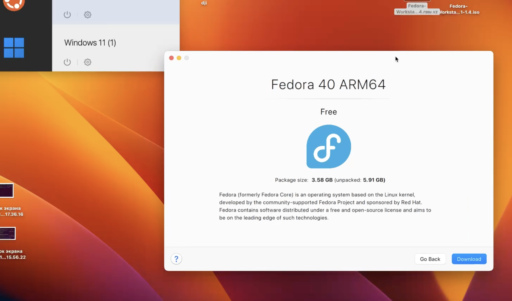{#fig:001 width=70%}

## После установки 
Запустил скачанную ОС 
Открыл терминал

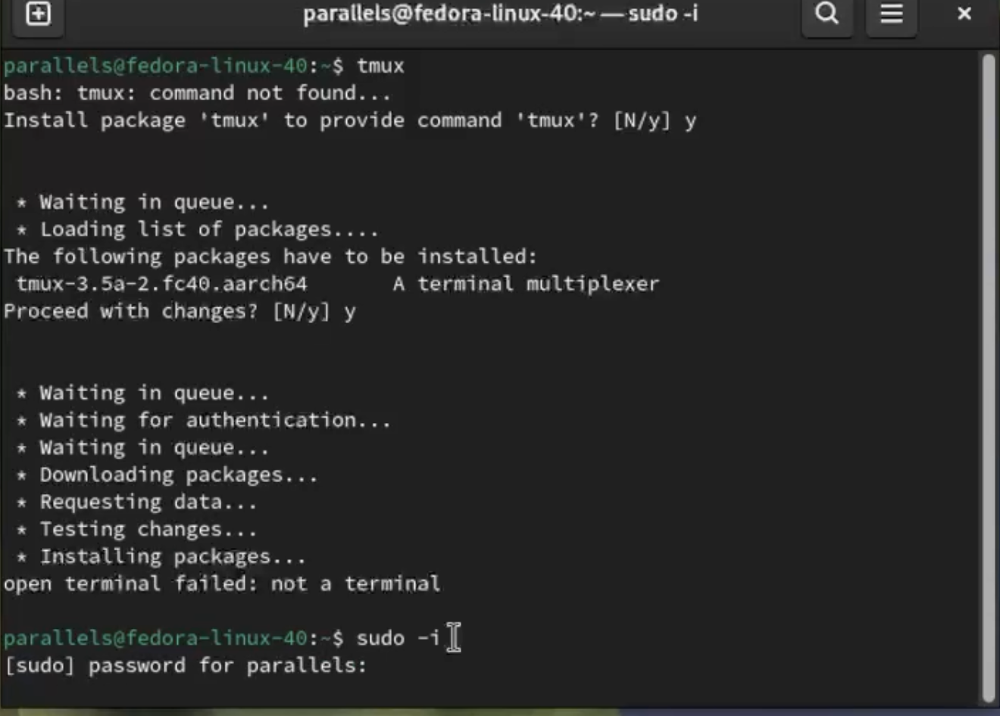 {#fig:002 width=70%}

### Обновления 

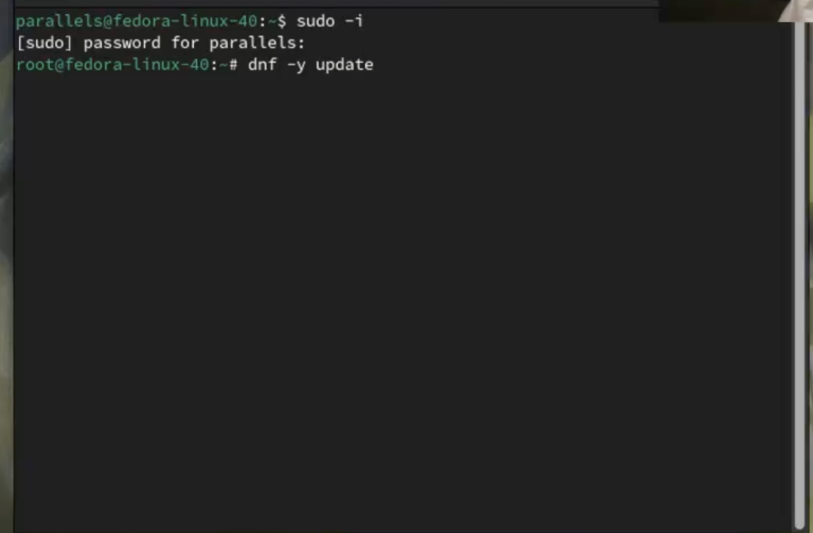 {#fig:003 width=70%}
 
### Повышение комфорта 

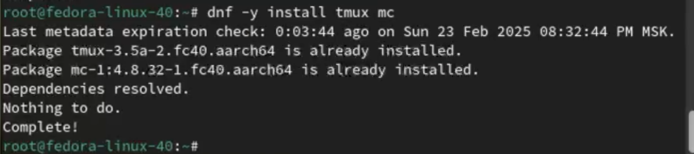 {#fig:004 width=70%}

### Отключение SElinux

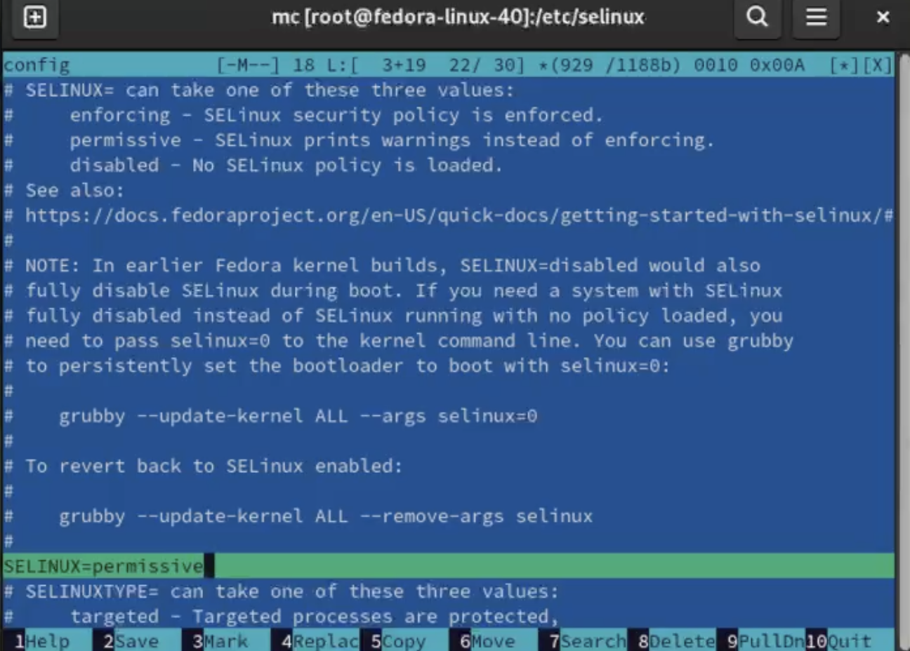 {#fig:005 width=70%}

Перезагрузил виртуальную машину командой (sudo systemctl reboot)

## Настройка раскладки клавиатуры 
Вошел в ОС под заданной мною при установке учётной записью
Запустил терминал
Создал конфигурационный файл ~/.config/sway/config.d/95-system-keyboard-config.conf:

mkdir -p ~/.config/sway

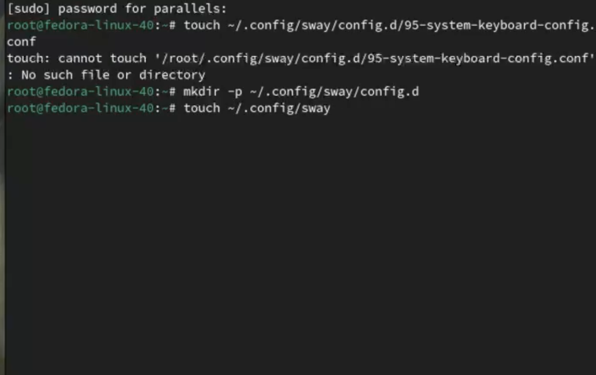 {#fig:006 width=70%}

Отредактировал конфигурационный файл ~/.config/sway/config.d/95-system-keyboard-config.conf:

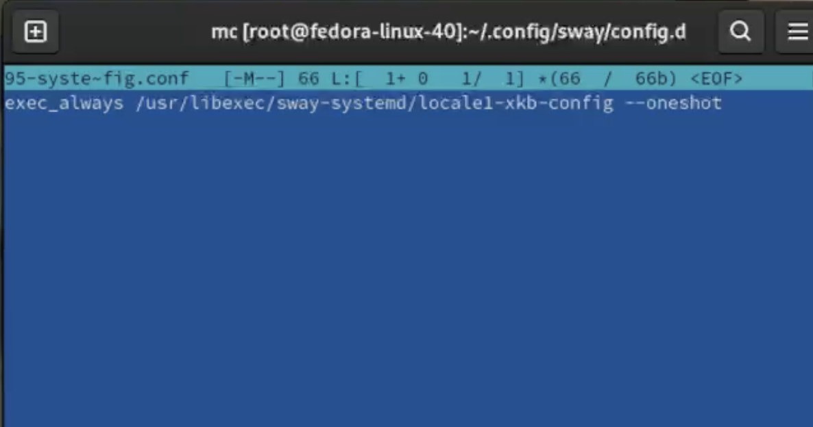 {#fig:007 width=70%}

Переключился на супер-пользователя (sudo -i)

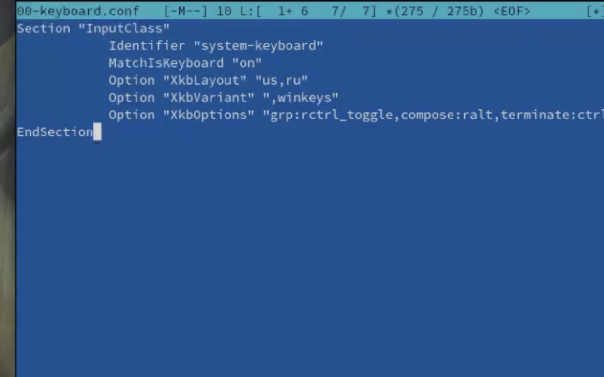 {#fig:008 width=70%}

Section "InputClass"
            Identifier "system-keyboard"
            MatchIsKeyboard "on"
            Option "XkbLayout" "us,ru"
            Option "XkbVariant" ",winkeys"
            Option "XkbOptions" "grp:rctrl_toggle,compose:ralt,terminate:ctrl_alt_bksp"
EndSection

Для этого можно использовать файловый менеджер mc и его встроенный редактор.
Перезагрузил виртуальную машину (sudo systemctl reboot)

## Установка имени пользователя
1. Переключился на роль супер-пользователя:
 sudo -i
2. Создаю пользователя (вместо username указываю логин в дисплейном классе):

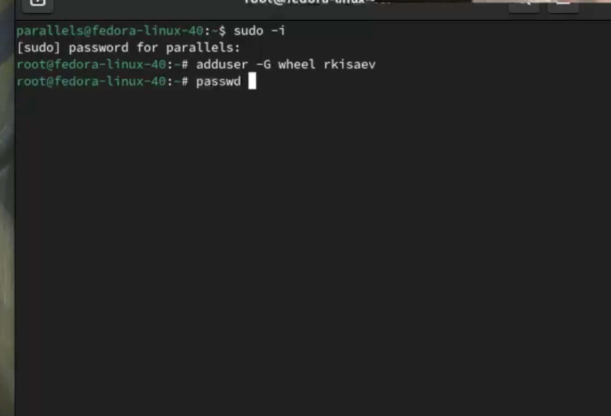 {#fig:009 width=70%}

3. Задаю пароль для пользователя (вместо username указываю логин в дисплейном классе):
passwd username
4. Установил имя хоста (вместо username указал логин в дисплейном классе):

hostnamectl set-hostname username
5. Проверил, что имя хоста установлено верно:
hostnamectl

## Установка программного обеспечения для создания документации
Запустил терминал 
Переключился на супер-пользователя (sudo -i)

### Работа с языком разметки Markdown

1. Средство pandoc для работы с языком разметки Markdown.
2. Установка с помощью менеджера пакетов:

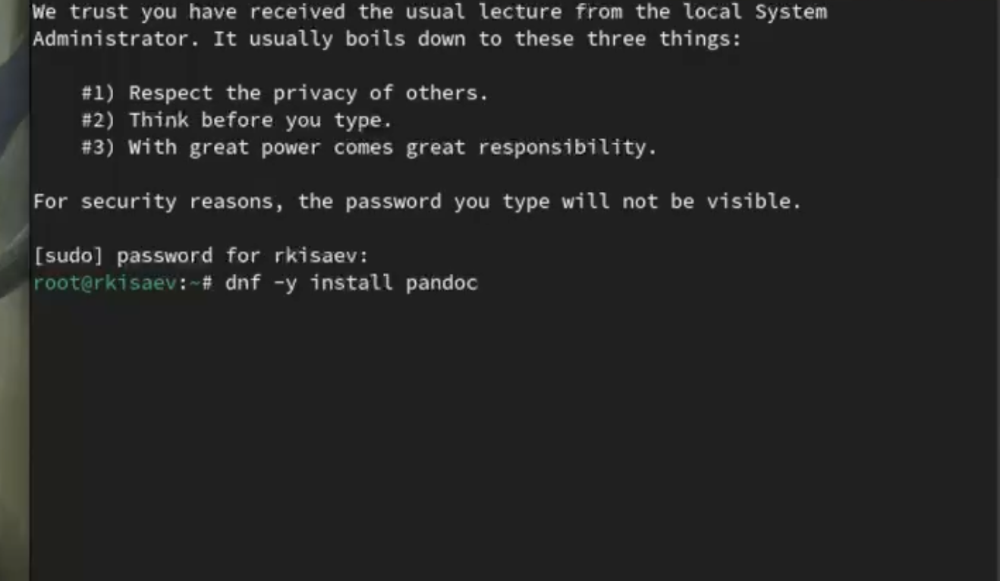 {#fig:010 width=70%}

3. Для работы с перекрёстными ссылками мы используем пакет pandoc-crossref.
Пакет pandoc-crossref в стандартном репозитории отсутствует.
Придётся ставить вручную, скачав с сайта https://github.com/lierdakil/pandoc-crossref.
При установке pandoc-crossref следует обращать внимание, для какой версии pandoc он скомпилён.
Лучше установить pandoc и pandoc-crossref вручную.
4. Скачал необходимую версию pandoc-crossref (https://github.com/lierdakil/pandoc-crossref/releases).
5. Распаковал архивы.
Обе программы собраны в виде статически-линкованных бинарных файлов.

6. 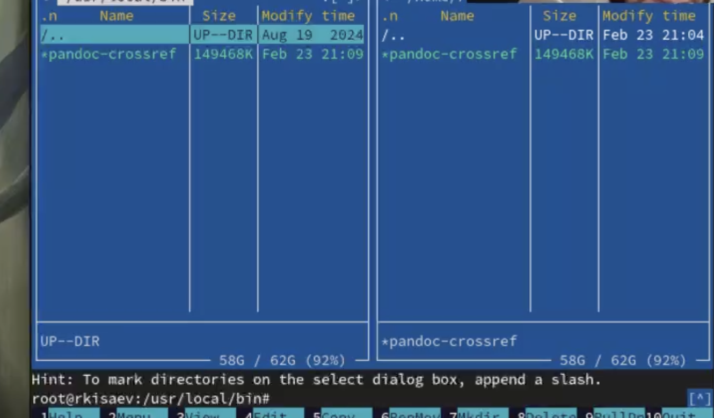 {#fig:011 width=70%}

### texlive
Установил дистрибутив TeXlive:

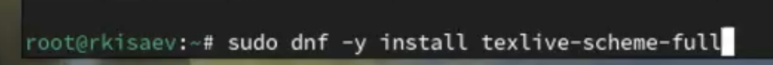 {#fig:011 width=70%}

Установил texlive

## Домашнее задание
Посмотрим порядок получения информации с помощью команды (dmesg | grep -i "то, что ищем")

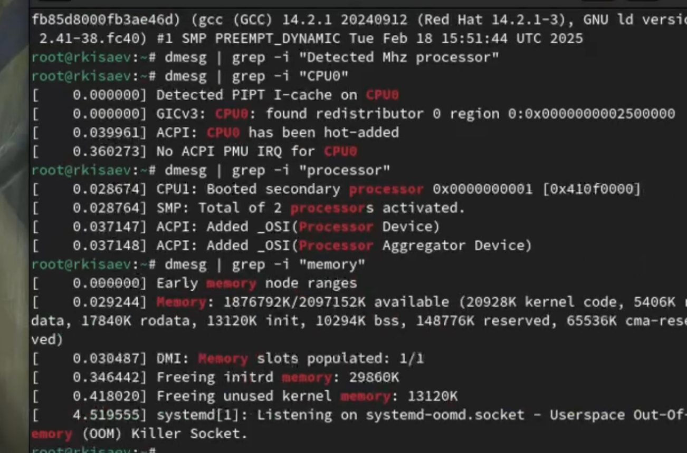 {#fig:013 width=70%}

# Вывод
В ходе работы были приобретены некоторые навыки, а именно (установка операционной системы fedora, настройка и установка необходимых программ)

# Контрольные вопросы
1) Какую информацию содержит учётная запись пользователя?
Имя пользователя, зашифрованный пароль, идентификационный номер пользователя, идентификационный номер группы, домашний каталог, командный интерпретатор пользователя.

2) Укажите команды терминала и приведите примеры:
для получения справки по команде; man <название команды> man cd
для перемещения по файловой системе; cd
для просмотра содержимого каталога; ls
для определения объёма каталога; du <имя каталога>
для создания каталога: mkdir <имя каталога>
для создания файла: touch <имя файла> 
для удаления каталогов; rm
для файлов; rm -r <имя файла>
для задания определённых прав на файл / каталог; chmod + x <имя каталога или файла>
для просмотра истории команд. history

3) Что такое файловая система? Приведите примеры с краткой характеристикой.
Файловая система - это часть операционной системы значений, которой сделать работу с данными более простым. Обеспечить совмсетное использование файлов несколькими пользователями и процессорами. 
Примеры файловых систем;
ext2, ext3, ext4 или extended filesystem - стандартная файловая система для linux
NTFS - станд. файловая система для windows 

4)Как посмотреть, какие файловые системы подмонтированы в ОС?
с помощью команды mount.

5) Как удалить зависший процесс?
команда kill.

# Список литературы 
Кулябов Д С - Введение в операционную систему UNix

