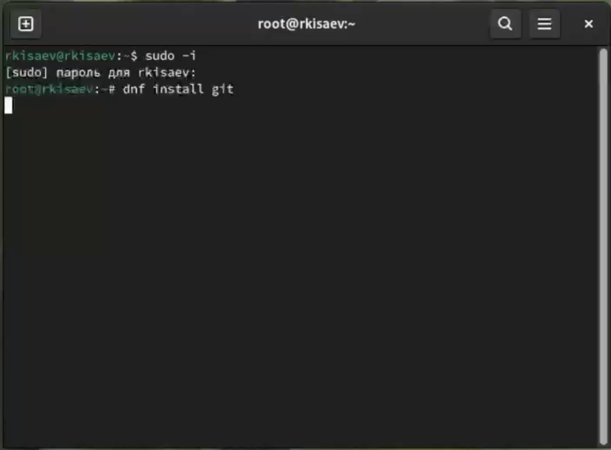
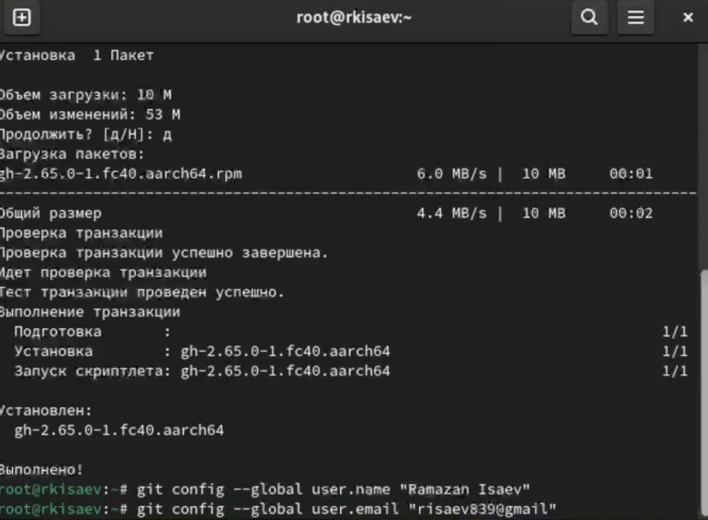
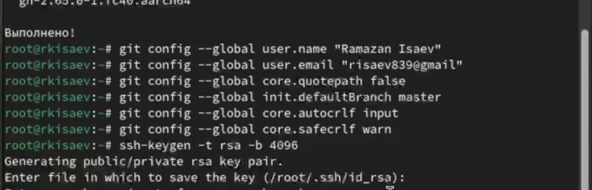
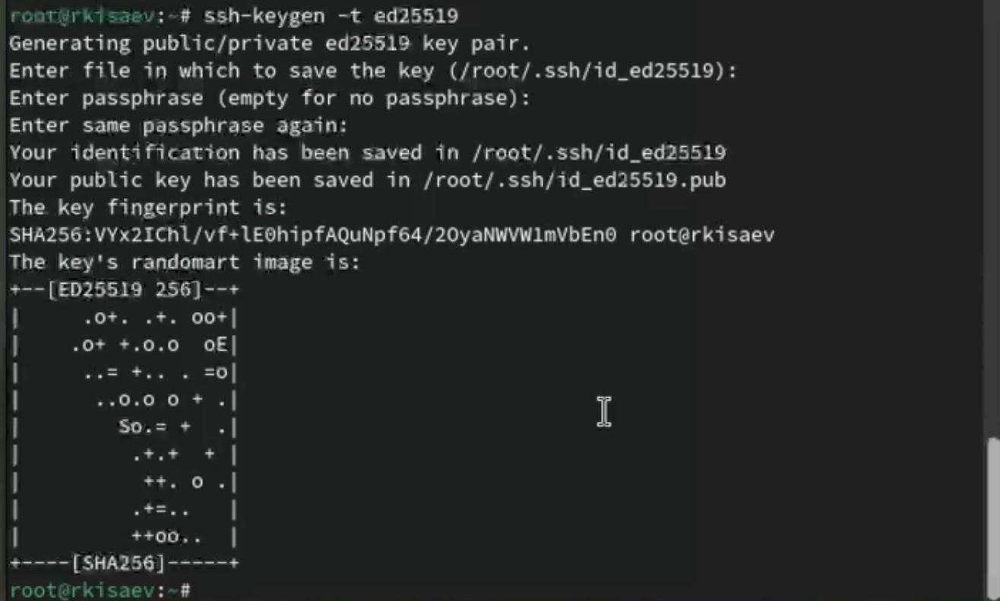
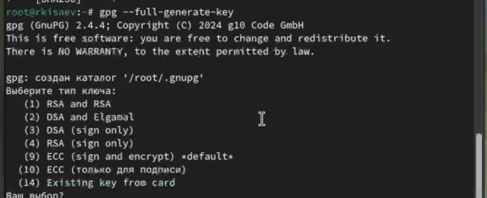
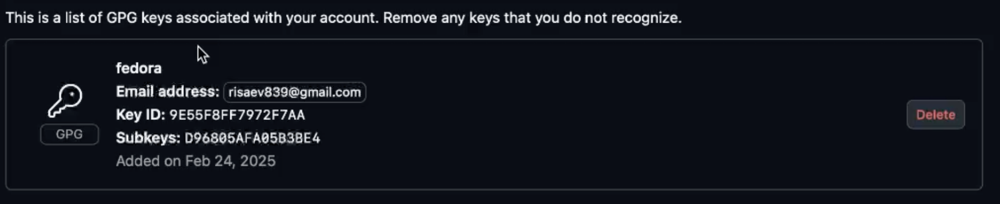
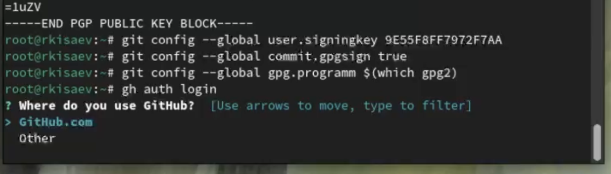
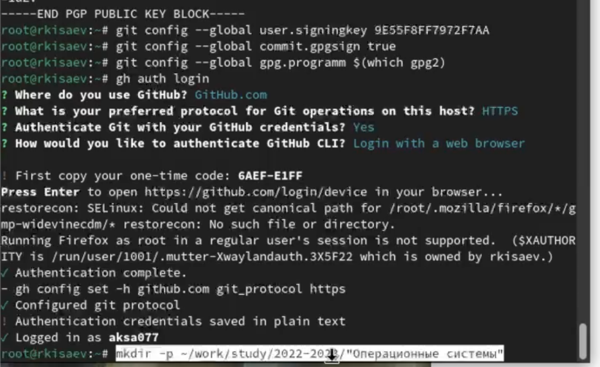
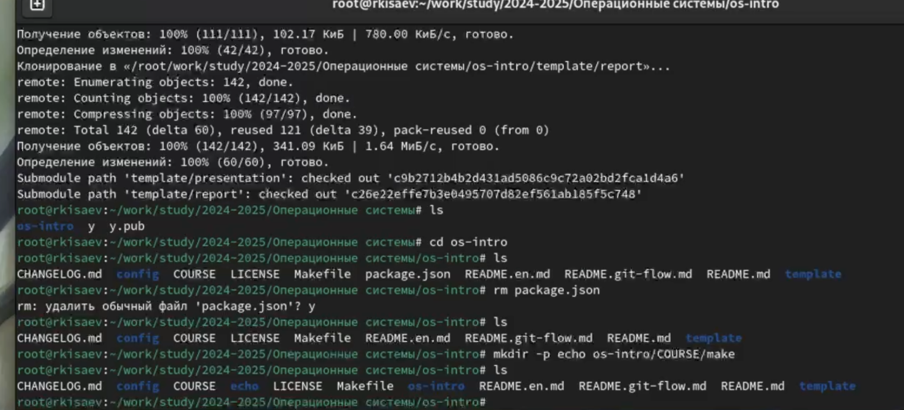
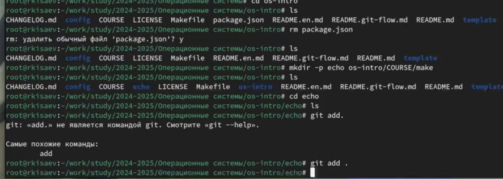

---
## Front matter
lang: ru-RU
title: Лабораторная работа 2
author:
  - Исаев Р. К.
institute:
  - Российский университет дружбы народов, Москва, Россия
  

## i18n babel
babel-lang: russian
babel-otherlangs: english

## Formatting pdf
toc: false
toc-title: Содержание
slide_level: 2
aspectratio: 169
section-titles: true
theme: metropolis
header-includes:
 - \metroset{progressbar=frametitle,sectionpage=progressbar,numbering=fraction}
---

# Информация

## Докладчик

:::::::::::::: {.columns align=center}
::: {.column width="70%"}

  * Исаев Рамазан Курбанович
  * студент НКАБД 01-24
  * Российский университет дружбы народов
  * <https://github.com/aksa077/study_2024-2025_os-intro.git>
:::
::: {.column width="30%"}

:::
::::::::::::::

# Цель работы

Изучить идеологию и применения средств контроля версий. Освоить умения по работе с git.

# Задание

1. Создать базовую конфигурацию для работы с git
2. Зарегистрироваться на GItHub.
3. Создать ключ GGH.
4. Создать ключ PGP.
5. Настроить подписи Git.
6. Создать локальный каталог для выполнения заданий по предмету.

# Теоретическое введение

Системы контроля версий (Version Control System, VCS) применяются при работе нескольких человек над одним проектом. Обычно основное дерево проекта хранится в локальном или удалённом репозитории, к которому настроен доступ для участников проекта. При внесении изменений в содержание проекта система контроля версий позволяет их фиксировать, совмещать изменения, произведённые разными участниками проекта, производить откат к любой более ранней версии проекта, если это требуется.

# Выполнение лабораторной работы

## Установил git перейдя на роль суперпользователя

{#fig:001 width=70%}

Установил gh

{#fig:002 width=70%}

## Базовая настройка Git.

Задал имя и email владельца репозитория.

{#fig:003 width=70%}

## Создание ключа SSH.

Создаю ключ по алгоритму rsa с размером 4096 бит и по алгоритму ed25519.

{#fig:004 width=70%}

## Создание ключа PGP.

Сгенерировал ключ.

{#fig:005 width=70%}

{#fig:006 width=70%}

## Добавление PGP ключа в GitHub

Добавил ключ в GitHub.

{#fig:007 width=70%}

{#fig:008 width=70%}

## Настройка автоматических подписей коммитов git

Используя введёный email, указал Git применил его при подписи коммитов:

{#fig:009 width=70%}

## Настройка gh

авторизовался с помощью команды gh auth login

{#fig:010 width=70%}

## Настройка каталога курса

Перешел в каталог курса

cd ~/work/study/2024-2025/"Операционные системы"/os-intro

Удалил лишние файлы:

{#fig:011 width=70%}

##

Отправил файлы на сервер:

{#fig:012 width=70%}

# Выводы

В итоге проделанной работы я изучил идеологию и применение средств контроля версий.
Освоил умение по работе с Git.

