---
## Front matter
title: " отчёт по лабораторной работе"
author: "Исаев Рамазан Курбанович"

## Generic otions
lang: ru-RU
toc-title: "Содержание"

## Bibliography
bibliography: bib/cite.bib
csl: pandoc/csl/gost-r-7-0-5-2008-numeric.csl

## Pdf output format
toc: true # Table of contents
toc-depth: 2
lof: true # List of figures
lot: true # List of tables
fontsize: 12pt
linestretch: 1.5
papersize: a4
documentclass: scrreprt
## I18n polyglossia
polyglossia-lang:
  name: russian
  options:
	- spelling=modern
	- babelshorthands=true
polyglossia-otherlangs:
  name: english
## I18n babel
babel-lang: russian
babel-otherlangs: english
## Fonts
mainfont: IBM Plex Serif
romanfont: IBM Plex Serif
sansfont: IBM Plex Sans
monofont: IBM Plex Mono
mathfont: STIX Two Math
mainfontoptions: Ligatures=Common,Ligatures=TeX,Scale=0.94
romanfontoptions: Ligatures=Common,Ligatures=TeX,Scale=0.94
sansfontoptions: Ligatures=Common,Ligatures=TeX,Scale=MatchLowercase,Scale=0.94
monofontoptions: Scale=MatchLowercase,Scale=0.94,FakeStretch=0.9
mathfontoptions:
## Biblatex
biblatex: true
biblio-style: "gost-numeric"
biblatexoptions:
  - parentracker=true
  - backend=biber
  - hyperref=auto
  - language=auto
  - autolang=other*
  - citestyle=gost-numeric
## Pandoc-crossref LaTeX customization
figureTitle: "Рис."
tableTitle: "Таблица"
listingTitle: "Листинг"
lofTitle: "Список иллюстраций"
lotTitle: "Список таблиц"
lolTitle: "Листинги"
## Misc options
indent: true
header-includes:
  - \usepackage{indentfirst}
  - \usepackage{float} # keep figures where there are in the text
  - \floatplacement{figure}{H} # keep figures where there are in the text
---

# Цель работы

Изучить идеологию и применения средств контроля версий. Освоить умения по работе с git.

# Задание

1. Создать базовую конфигурацию для работы с git
2. Зарегистрироваться на GItHub.
3. Создать ключ GGH.
4. Создать ключ PGP.
5. Настроить подписи Git.
6. Создать локальный каталог для выполнения заданий по предмету.

# Теоретическое введение

Системы контроля версий (Version Control System, VCS) применяются при работе нескольких человек над одним проектом. Обычно основное дерево проекта хранится в локальном или удалённом репозитории, к которому настроен доступ для участников проекта. При внесении изменений в содержание проекта система контроля версий позволяет их фиксировать, совмещать изменения, произведённые разными участниками проекта, производить откат к любой более ранней версии проекта, если это требуется.

В классических системах контроля версий используется централизованная модель, предполагающая наличие единого репозитория для хранения файлов. Выполнение большинства функций по управлению версиями осуществляется специальным сервером. Участник проекта (пользователь) перед началом работы посредством определённых команд получает нужную ему версию файлов. После внесения изменений, пользователь размещает новую версию в хранилище. При этом предыдущие версии не удаляются из центрального хранилища и к ним можно вернуться в любой момент. Сервер может сохранять не полную версию изменённых файлов, а производить так называемую дельта-компрессию — сохранять только изменения между последовательными версиями, что позволяет уменьшить объём хранимых данных.

Системы контроля версий поддерживают возможность отслеживания и разрешения конфликтов, которые могут возникнуть при работе нескольких человек над одним файлом. Можно объединить (слить) изменения, сделанные разными участниками (автоматически или вручную), вручную выбрать нужную версию, отменить изменения вовсе или заблокировать файлы для изменения. В зависимости от настроек блокировка не позволяет другим пользователям получить рабочую копию или препятствует изменению рабочей копии файла средствами файловой системы ОС, обеспечивая таким образом, привилегированный доступ только одному пользователю, работающему с файлом.

Системы контроля версий также могут обеспечивать дополнительные, более гибкие функциональные возможности. Например, они могут поддерживать работу с несколькими версиями одного файла, сохраняя общую историю изменений до точки ветвления версий и собственные истории изменений каждой ветви. Кроме того, обычно доступна информация о том, кто из участников, когда и какие изменения вносил. Обычно такого рода информация хранится в журнале изменений, доступ к которому можно ограничить.

В отличие от классических, в распределённых системах контроля версий центральный репозиторий не является обязательным.

Среди классических VCS наиболее известны CVS, Subversion, а среди распределённых — Git, Bazaar, Mercurial. Принципы их работы схожи, отличаются они в основном синтаксисом используемых в работе команд.

# Выполнение лабораторной работы

## Установил git перейдя на роль суперпользователя

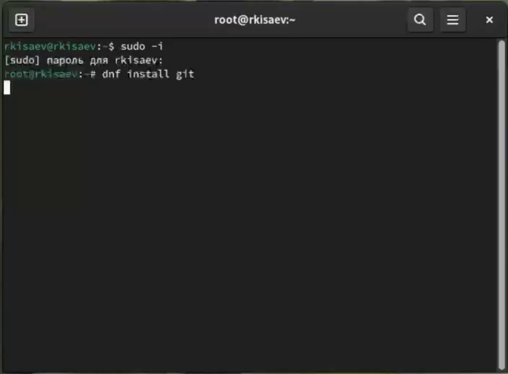{#fig:001 width=70%}

Установил gh

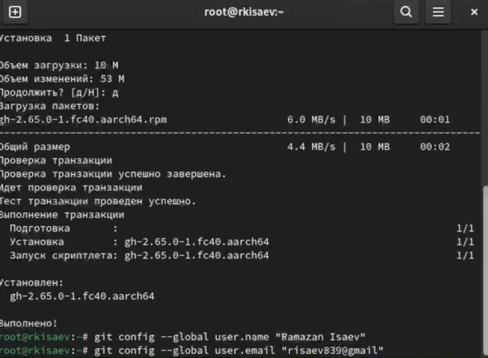{#fig:002 width=70%}

## Базовая настройка Git.

Задал имя и email владельца репозитория.

{#fig:003 width=70%}

## Создание ключа SSH.

Создаю ключ по алгоритму rsa с размером 4096 бит и по алгоритму ed25519.

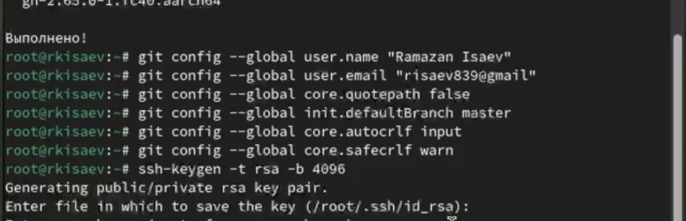{#fig:004 width=70%}

## Создание ключа PGP.

Сгенерировал ключ.

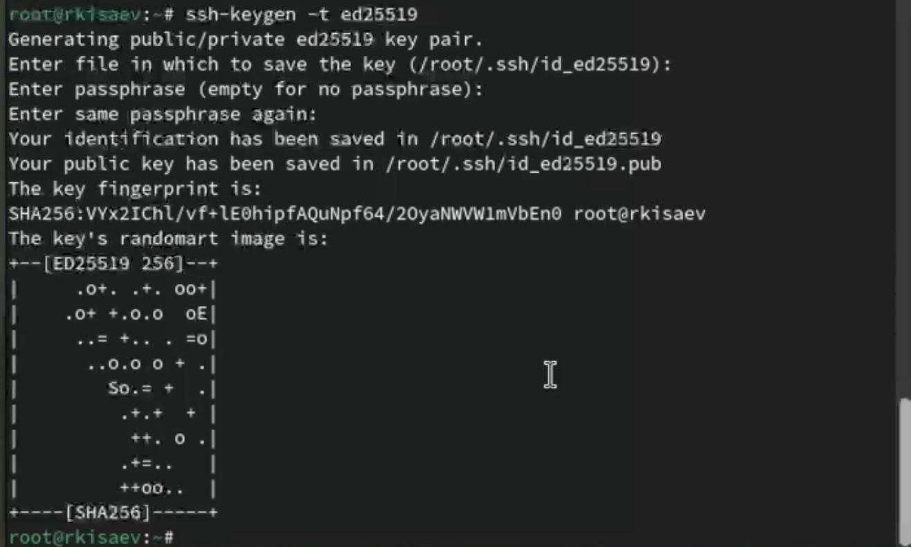{#fig:005 width=70%}

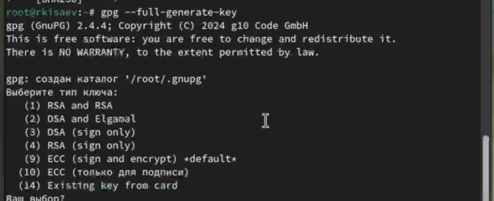{#fig:006 width=70%}

## Добавление PGP ключа в GitHub

Добавил ключ в GitHub.

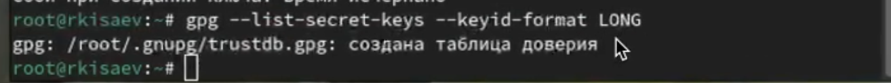{#fig:007 width=70%}

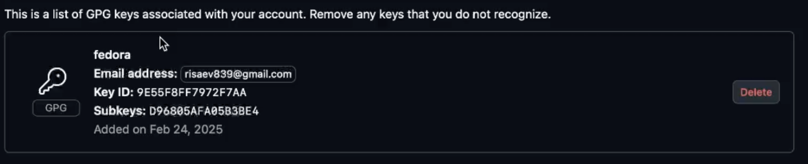{#fig:008 width=70%}

## Настройка автоматических подписей коммитов git

Используя введёный email, указал Git применил его при подписи коммитов:

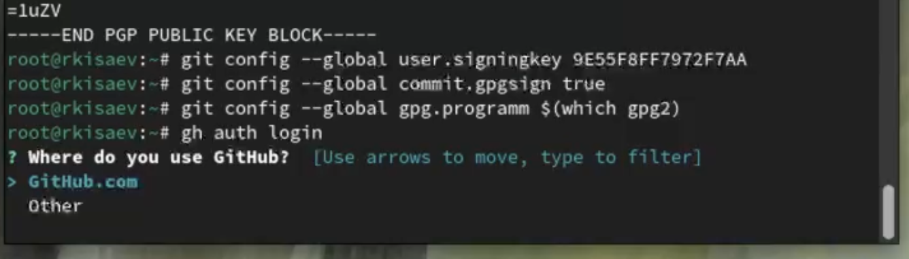{#fig:009 width=70%}

## Настройка gh

авторизовался с помощью команды gh auth login

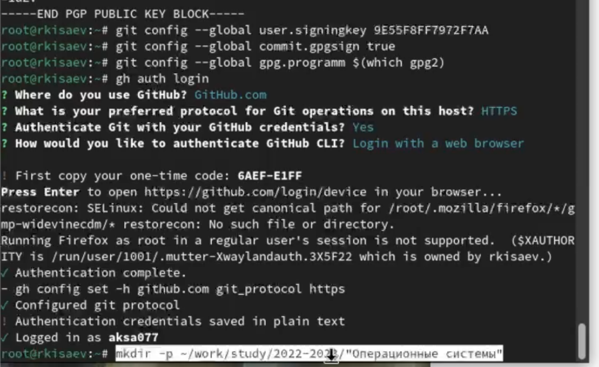{#fig:010 width=70%}

## Создание репозитория курса 

Создал репозиторий по шаблону 

mkdir -p ~/work/study/2024-2025/"Операционные системы"

cd ~/work/study/2024-2025/"Операционные системы"

gh repo create study_2024-2025_os-intro --template=yamadharma/course-directory-student-template --public

git clone --recursive git@github.com:<owner>/study_2024-2025_os-intro.git os-intro

### Настройка каталога курса

Перешел в каталог курса

cd ~/work/study/2024-2025/"Операционные системы"/os-intro

Удалил лишние файлы:

rm package.json

Создал необходимые каталоги:

echo os-intro > COURSE

make

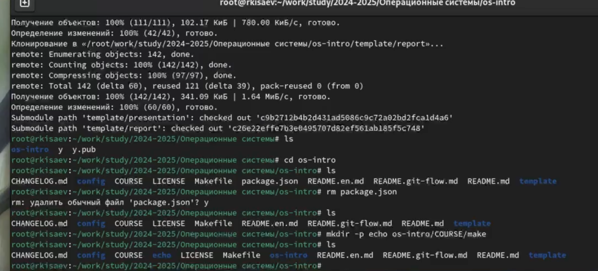{#fig:011 width=70%}

Отправил файлы на сервер:

git add .

git commit -am 'feat(main): make course structure'

git push

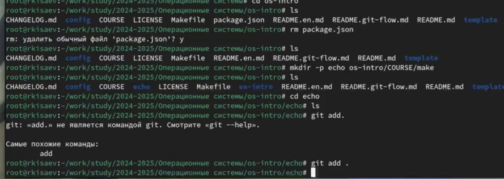{#fig:012 width=70%}

# Выводы

В итоге проделанной работы я изучил идеологию и применение средств контроля версий.
Освоил умение по работе с Git.

# Контрольные вопросы

1. Что такое системы контроля версий (VCS) и для решения каких задач они предназначаются?
Системы контроля версий (VCS) — это инструмент, который помогает разработчикам отслеживать изменения в коде, управлять различными версиями файлов и координировать работу в команде. 

Задачи, для решения которых предназначаются системы контроля версий:

Отслеживание изменений. Можно узнать, когда, кем и зачем был создан, удалён или отредактирован какой-либо файл в репозитории. Это облегчает процесс поиска ошибок и отладки кода, помогает избежать путаницы и конфликтов. 243
Защита исходного кода. Система контроля версий предотвращает случайное или намеренное удаление, а также изменение важных файлов или функций, что может привести к нарушению работы программы. 
Возможность отката. Система контроля версий позволяет восстанавливать предыдущие версии кода. Это может быть необходимо в случае ошибки или для сравнения с текущей версией. 3
Командная работа. С помощью системы контроля версий удобно организовывать совместную работу над проектом. Каждый участник может выполнять свою часть работы, а система помогает объединять результаты. 

2. Объясните следующие понятия VCS и их отношения: хранилище, commit, история, рабочая копия.

Хранилище (репозиторий) в системе контроля версий (VCS) — это система, которая обеспечивает хранение всех существовавших версий файлов. В дальнейшем содержимое репозитория изменяется не напрямую, а опосредованно через рабочие копии. 

Commit — это запись изменений. С помощью коммитов изменения, внесённые в рабочую копию, заносятся в хранилище. 

История — список предыдущих изменений. Благодаря истории можно отследить изменения, вносимые в репозиторий. 

Рабочая копия — копия файла, с которой непосредственно ведётся работа (находится вне репозитория). Перед началом работы рабочую копию можно получить из одной из версий, хранящихся в репозитории.

3. Что представляют собой и чем отличаются централизованные и децентрализованные VCS? Приведите примеры VCS каждого вида.

VCS. Version Control System (VCS)– система контроля версий. Из названия следует основной кейс применения таких систем – контроль версий систем. VCS сохраняет изменения, которые произошли от одной версии файла к другой. В качестве систем могут быть файлы с кодом программ, скриптов или конфигурационные файлы (например, файлы конфигурации DHCP, файлы зон DNS, настроек iptables или apache).

4. Опишите действия с VCS при единоличной работе с хранилищем.

Действия с VCS при единоличной работе с хранилищем включают следующие этапы:

Получение нужной версии документа. Обычно создаётся локальная копия документа — рабочая копия. Может быть получена последняя версия или любая из предыдущих, которая может быть выбрана по номеру версии или дате создания, иногда и по другим признакам. 
Обновление рабочей копии. По мере внесения изменений в основную версию проекта рабочая копия на компьютере разработчика стареет: расхождение её с основной версией проекта увеличивается. Чтобы поддерживать рабочую копию в состоянии, максимально близком к текущей основной версии, нужно выполнять операцию обновления рабочей копии (update) насколько возможно часто. 
Модификация проекта. Разработчик изменяет входящие в него файлы в рабочей копии в соответствии с проектным заданием. Эта работа производится локально и не требует обращений к серверу VCS. 
Фиксация изменений. Завершив очередной этап работы над заданием, разработчик фиксирует (commit) свои изменения, передавая их на сервер (либо в основную ветвь, если работа над заданием полностью завершена, либо в отдельную ветвь разработки данного задания). 

5. Опишите порядок работы с общим хранилищем VCS.

Порядок работы с общим хранилищем VCS (систем контроля версий) предполагает следующие шаги:

Извлечение рабочей копии проекта. Это выполняется с помощью команды извлечения версии (обычно checkout или clone). Разработчик задаёт версию, которая должна быть скопирована, по умолчанию обычно копируется последняя или выбранная администратором в качестве основной версия. 
Дублирование рабочей копии. Помимо основного каталога с проектом на локальный диск дополнительно записывается ещё одна его копия. Работая с проектом, разработчик изменяет только файлы основной рабочей копии. Вторая локальная копия хранится в качестве эталона, позволяя в любой момент без обращения к серверу определить, какие изменения внесены в конкретный файл или проект в целом и от какой версии была «отпочкована» рабочая копия. 
Обновление рабочей копии. VCS может требовать от разработчика перед фиксацией обязательно выполнить обновление рабочей копии. При наличии в системе поддержки отложенных изменений изменения могут быть переданы на сервер без фиксации. Если утверждённая политика работы в VCS это позволяет, то фиксация изменений может проводиться не ежедневно, а только по завершении работы над заданием. 
Размещение изменений в хранилище. После внесения изменений пользователь размещает новую версию в хранилище. При этом предыдущие версии не удаляются из центрального хранилища и к ним можно вернуться в любой момент. 
Разрешение конфликтов. Системы контроля версий поддерживают возможность отслеживания и разрешения конфликтов, которые могут возникнуть при работе нескольких человек над одним файлом. Можно объединить (слить) изменения, сделанные разными участниками (автоматически или вручную), вручную выбрать нужную версию, отменить изменения вовсе или заблокировать файлы для изменения. 

6. Каковы основные задачи, решаемые инструментальным средством git?

Основные задачи, решаемые инструментальным средством Git, включают:

Возврат к предыдущей версии кода. Это необходимо, если решаемая задача больше не является актуальной, требуется внести исправления в более раннюю версию программы или обнаружилась ошибка. 
Параллельная разработка. Git позволяет вести параллельную разработку, когда несколько программистов одновременно вносят изменения в одно приложение или сайт, но при этом не мешают друг другу. 
Отсутствие конфликтов в коде. Распределённая система контроля версий гарантирует отсутствие конфликтов в коде и возможность вести разработку нескольких функций ПО, не соприкасаясь друг с другом и общим кодом. 
Восстановление проекта в случае сбоя. Если во время разработки случится сбой, то с помощью Git можно отменить нежелательные изменения и восстановить проект. 

7. Назовите и дайте краткую характеристику командам git.

Некоторые команды Git и их краткая характеристика:

git init. Используется для создания нового репозитория Git. Создаёт первый коммит с начальным состоянием проекта. 
git add. Добавляет изменённые файлы в индекс, который позже будет использоваться для создания коммита. Позволяет выбирать, какие изменения включать в следующий коммит, а какие нет. 
git commit. Создаёт новый коммит на основе текущего состояния индекса. В сообщении коммита можно описать внесённые изменения и дать им осмысленное название. 
git push. Отправляет изменения из локального репозитория на сервер. 
git pull. Извлекает изменения с сервера и объединяет их с локальным репозиторием. 
git checkout. Позволяет переключиться с одной ветки на другую. 
git merge. Позволяет добавить изменения из одной ветки в другую. Процесс завершается появлением общего коммита для объединённых веток. 

8. Приведите примеры использования при работе с локальным и удалённым репозиториями.

Некоторые примеры использования команд при работе с локальным и удалённым репозиториями:

Создание локального репозитория. Команда git init создаёт локальный репозиторий в папке с проектом. После выполнения этой команды появится новая папка с именем .git, в ней будет несколько файлов и поддиректорий. 
Создание репозитория на GitHub. Команда git clone https://github.com/myuser/project.git создаёт репозиторий на GitHub, который будет содержать локальный репозиторий (папку .git). 
Получение обновлений с удалённого репозитория. Команда git pull получает последнюю версию проекта из удалённого репозитория и подтягивают её в локальный. 
Отправка изменений в удалённый репозиторий. Команда git push отправляет все зафиксированные изменения с локального репозитория в удалённый. 
Откладывание текущих изменений. Команда git stash откладывает текущие изменения, после чего локальная директория будет содержать файлы в состоянии последнего коммита. Затем можно загрузить новые файлы из удалённого репозитория командой git pull и вернуть отложенные изменения командой git stash pop. 

9. Что такое и зачем могут быть нужны ветви (branches)?

Ветка (англ. branch) — это последовательность коммитов, в которой ведётся параллельная разработка какого-либо функционала Основная ветка– master Ветки в GIT. Показать все ветки, существующие в репозитарии git branch. Создать ветку git branch имя.
найдено на itnan.ru
Ветки нужны, чтобы несколько программистов могли вести работу над одним и тем же проектом или даже файлом одновременно, при этом не мешая друг другу. Кроме того, ветки используются для тестирования экспериментальных функций: чтобы не повредить основному проекту, создается новая ветка специально для экспериментов.

10. Как и зачем можно игнорировать некоторые файлы при commit?

Чтобы игнорировать некоторые файлы при коммите в Git, нужно создать файл .gitignore в корне проекта. В него с помощью текстового редактора добавляются имена файлов и директорий, которые надо игнорировать. 

Зачем можно игнорировать файлы при коммите: это помогает исключить из коммитов ненужные файлы, которые не несут пользы с точки зрения исходного кода. Например, конфигурационные файлы, содержащие ключи или пароли, внешние зависимости, каталоги для временного хранения и другие. 

Также игнорирование файлов защищает от случайного коммита конфиденциальной информации, такой как пароли или ключи API. 

# Список литературы{.unnumbered}

Кульбаков
