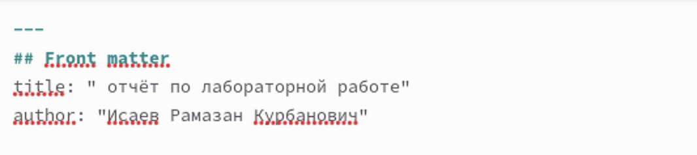
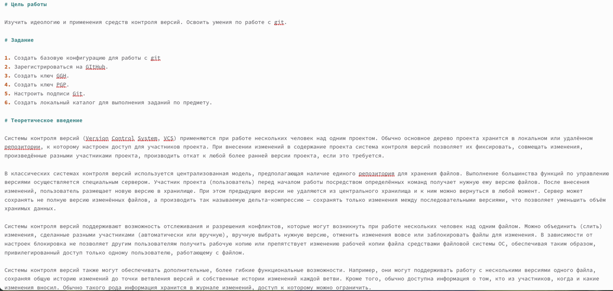
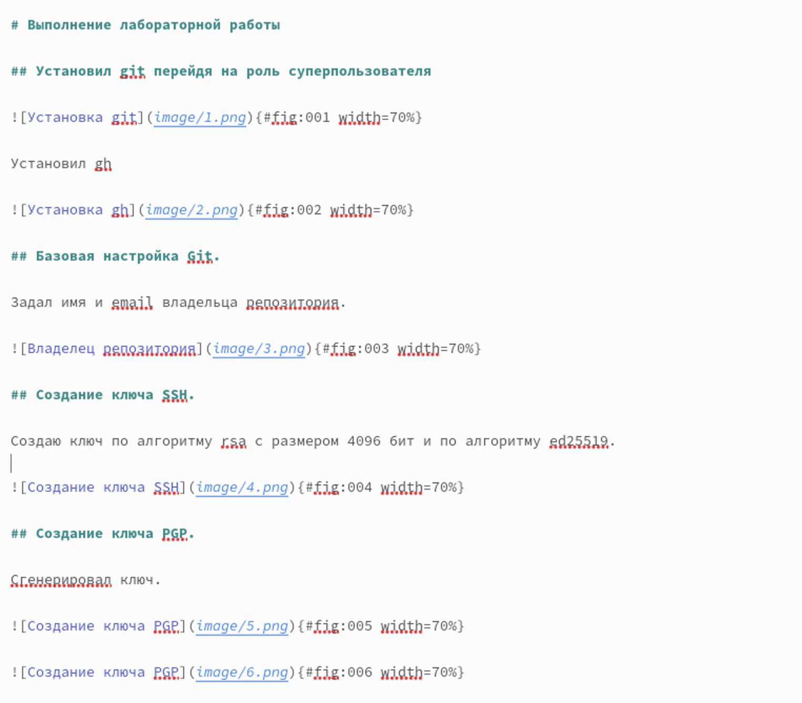
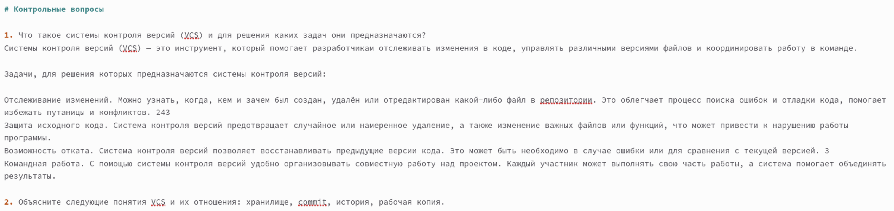
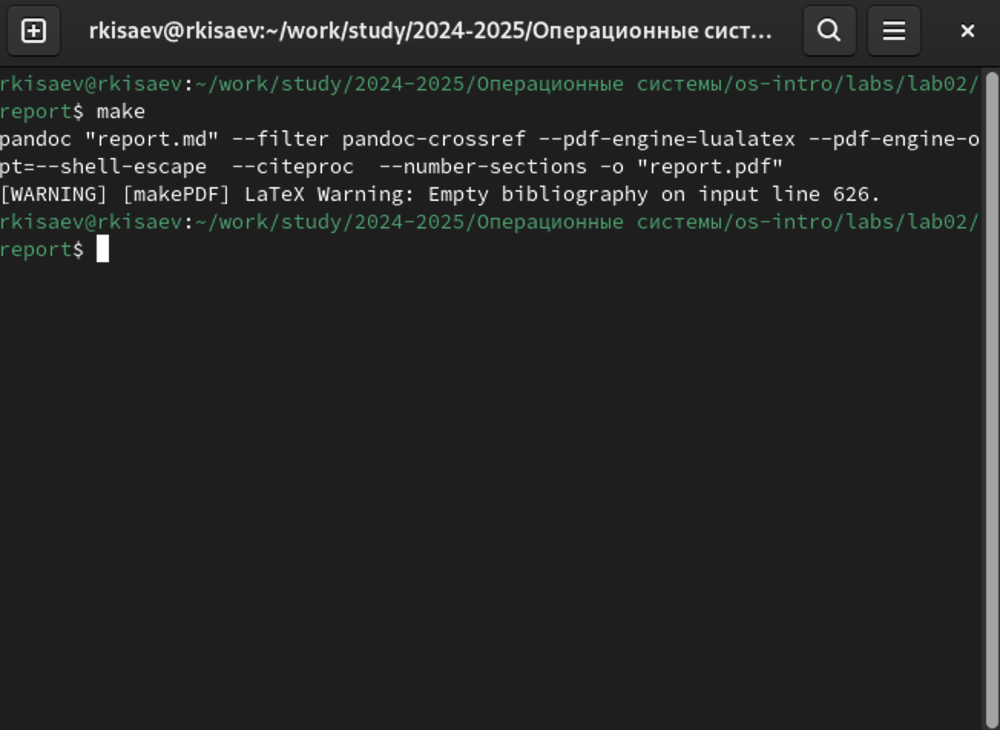

---
## Front matter
title: "Отчёт по лабораторной работе 3"
author: "Исаев Рамазан Курбанович"

## Generic otions
lang: ru-RU
toc-title: "Содержание"

## Bibliography
bibliography: bib/cite.bib
csl: pandoc/csl/gost-r-7-0-5-2008-numeric.csl

## Pdf output format
toc: true # Table of contents
toc-depth: 2
lof: true # List of figures
lot: true # List of tables
fontsize: 12pt
linestretch: 1.5
papersize: a4
documentclass: scrreprt
## I18n polyglossia
polyglossia-lang:
  name: russian
  options:
	- spelling=modern
	- babelshorthands=true
polyglossia-otherlangs:
  name: english
## I18n babel
babel-lang: russian
babel-otherlangs: english
## Fonts
mainfont: IBM Plex Serif
romanfont: IBM Plex Serif
sansfont: IBM Plex Sans
monofont: IBM Plex Mono
mathfont: STIX Two Math
mainfontoptions: Ligatures=Common,Ligatures=TeX,Scale=0.94
romanfontoptions: Ligatures=Common,Ligatures=TeX,Scale=0.94
sansfontoptions: Ligatures=Common,Ligatures=TeX,Scale=MatchLowercase,Scale=0.94
monofontoptions: Scale=MatchLowercase,Scale=0.94,FakeStretch=0.9
mathfontoptions:
## Biblatex
biblatex: true
biblio-style: "gost-numeric"
biblatexoptions:
  - parentracker=true
  - backend=biber
  - hyperref=auto
  - language=auto
  - autolang=other*
  - citestyle=gost-numeric
## Pandoc-crossref LaTeX customization
figureTitle: "Рис."
tableTitle: "Таблица"
listingTitle: "Листинг"
lofTitle: "Список иллюстраций"
lotTitle: "Список таблиц"
lolTitle: "Листинги"
## Misc options
indent: true
header-includes:
  - \usepackage{indentfirst}
  - \usepackage{float} # keep figures where there are in the text
  - \floatplacement{figure}{H} # keep figures where there are in the text
---

# Цель работы

Научиться оформлять отчёты с помощью легковесного языка разметки Markdown.

# Задание

Сделать отчёт по предыдущей лабораторной работе в формате Markdown.
В качестве отчёта просьба предоставить отчёты в 3 форматах: pdf, docxи md(в архиве,
поскольку он должен содержать скриншоты, Makefile и т.д.)

# Теоретическое введение

Чтобы создать заголовок, используйте знак ( # ). Чтобы задать для текста полужирное начертание, заключите его в двойные звездочки. Чтобы задать для текста курсивное начертание, заключите его в одинарные звездочки. Чтобы задать для текста полужирное и курсивное начертание, заключите его в тройные звездочки. Блоки цитирования создаются с помощью символа >. Неупорядоченный (маркированный) список можно отформатировать с помощью звез- дочек или тире. Чтобы вложить один список в другой, добавьте отступ для элементов дочернего списка. Упорядоченный список можно отформатировать с помощью соответствующих цифр. Чтобы вложить один список в другой, добавьте отступ для элементов дочернего списка. Синтаксис Markdown для встроенной ссылки состоит из части [link text] , представ- ляющей текст гиперссылки, и части (file-name.md) – URL-адреса или имени файла, на который дается ссылка. Markdown поддерживает как встраивание фрагментов кода в предложение, так и их размещение между предложениями в виде отдельных огражденных блоков. Огражденные блоки кода — это простой способ выделить синтаксис для фрагментов кода. Внутритекстовые формулы делаются аналогично формулам LaTeX. Для обработки файлов в формате Markdown будем использовать Pandoc. Конкретно, нам понадобится программа pandoc , pandoc-citeproc https://github.com/jgm/pandoc/releases, pandoc-crossref https://github.com/lierdakil/pandoc-crossref/releases. Преобразовать файл README.md можно следующим образом: 1 pandoc README.md -o README.pdf или так 1 pandoc README.md -o README.docx 

# Выполнение лабораторной работы

## Оформление отчета к лабораторной работе №2

1. Открываем подготовленный файл .md и заменяем на свои данные ( имя автора, тема лабораторной работы)

{#fig:001 width=70%}

2. Записываем цель работы и теоретическое введение 

{#fig:002 width=70%}

3. Начинаем выполнять основную часть лабораторной работы

{#fig:003 width=70%}

4. Подводим итоги и отвечаем на контрольные вопросы

{#fig:004 width=70%}

5. С помощью команды make создаем отчет в форматах docx и pdf

{#fig:005 width=70%}

# Выводы

Мы научились создавать отчет с помощью легковесного языка разметки Markdown.

# Список литературы{.unnumbered}

