---
## Front matter
title: "Отчёт по лабораторной работе"
author: "Исаев Рамазан Курбанович"

## Generic otions
lang: ru-RU
toc-title: "Содержание"

## Bibliography
bibliography: bib/cite.bib
csl: pandoc/csl/gost-r-7-0-5-2008-numeric.csl

## Pdf output format
toc: true # Table of contents
toc-depth: 2
lof: true # List of figures
lot: true # List of tables
fontsize: 12pt
linestretch: 1.5
papersize: a4
documentclass: scrreprt
## I18n polyglossia
polyglossia-lang:
  name: russian
  options:
	- spelling=modern
	- babelshorthands=true
polyglossia-otherlangs:
  name: english
## I18n babel
babel-lang: russian
babel-otherlangs: english
## Fonts
mainfont: IBM Plex Serif
romanfont: IBM Plex Serif
sansfont: IBM Plex Sans
monofont: IBM Plex Mono
mathfont: STIX Two Math
mainfontoptions: Ligatures=Common,Ligatures=TeX,Scale=0.94
romanfontoptions: Ligatures=Common,Ligatures=TeX,Scale=0.94
sansfontoptions: Ligatures=Common,Ligatures=TeX,Scale=MatchLowercase,Scale=0.94
monofontoptions: Scale=MatchLowercase,Scale=0.94,FakeStretch=0.9
mathfontoptions:
## Biblatex
biblatex: true
biblio-style: "gost-numeric"
biblatexoptions:
  - parentracker=true
  - backend=biber
  - hyperref=auto
  - language=auto
  - autolang=other*
  - citestyle=gost-numeric
## Pandoc-crossref LaTeX customization
figureTitle: "Рис."
tableTitle: "Таблица"
listingTitle: "Листинг"
lofTitle: "Список иллюстраций"
lotTitle: "Список таблиц"
lolTitle: "Листинги"
## Misc options
indent: true
header-includes:
  - \usepackage{indentfirst}
  - \usepackage{float} # keep figures where there are in the text
  - \floatplacement{figure}{H} # keep figures where there are in the text
---

# Цель работы

Получение навыков правильной работы с репозиториями git.

# Задание

Выполнить работу для тестового репозитория.
Преобразовать рабочий репозиторий в репозиторий с git-flow и conventional commits.

# Теоретическое введение

Gitflow Workflow опубликована и популяризована Винсентом Дриссеном.

Gitflow Workflow предполагает выстраивание строгой модели ветвления с учётом выпуска проекта.

Данная модель отлично подходит для организации рабочего процесса на основе релизов.

Работа по модели Gitflow включает создание отдельной ветки для исправлений ошибок в рабочей среде.

Последовательность действий при работе по модели Gitflow:

Из ветки master создаётся ветка develop.

Из ветки develop создаётся ветка release.

Из ветки develop создаются ветки feature.

Когда работа над веткой feature завершена, она сливается с веткой develop.

Когда работа над веткой релиза release завершена, она сливается в ветки develop и master.

Если в master обнаружена проблема, из master создаётся ветка hotfix.

Когда работа над веткой исправления hotfix завершена, она сливается в ветки develop и master.

# Выполнение лабораторной работы

## Установка программного обеспечения

1. Установка git-flow

{#fig:001 width=70%}

2. Установка Node.js

На Node.js базируется программное обеспечение для семантического версионирования и общепринятых коммитов.

{#fig:002 width=70%}

3. Для работы с Node.js добавим каталог с исполняемыми файлами

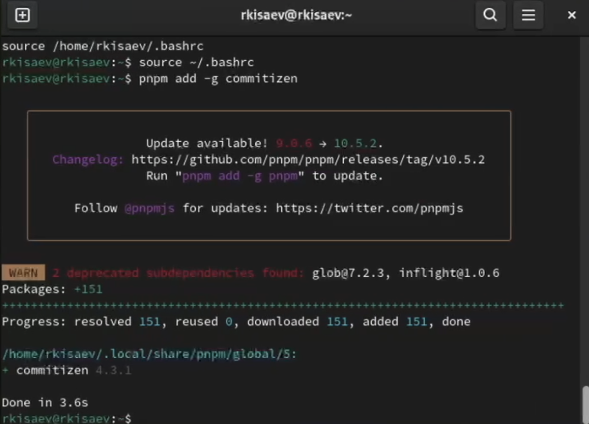{#fig:003 width=70%}

4. Настраиваем commitizen, standard-changelog

{#fig:021 width=70%}

## Практический сценарий использования git

1. Подключение репозитория к github. 
Создаем репозиторий Git, для примера назовём его git-extended.

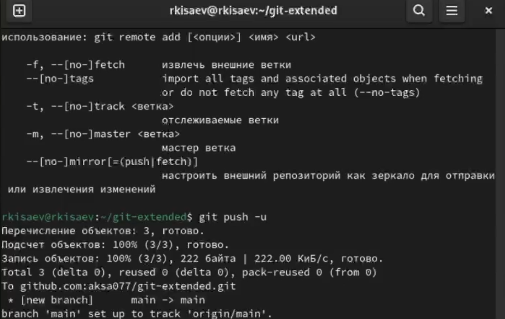{#fig:004 width=70%}

2. Конфигурация общепринятых коммитов. Для этого добавим в файл package.json команду для форматирования коммитов.

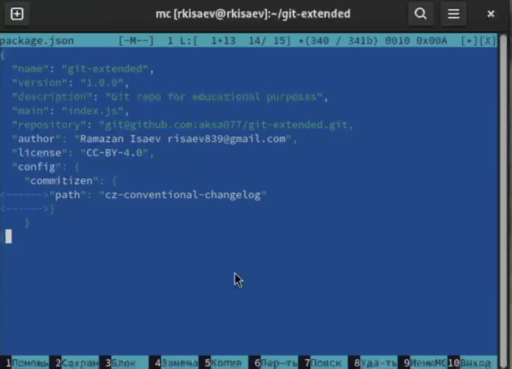{#fig:005 width=70%}

3. Добавляем файлы, выполняем коммит, отправляем на Github. 

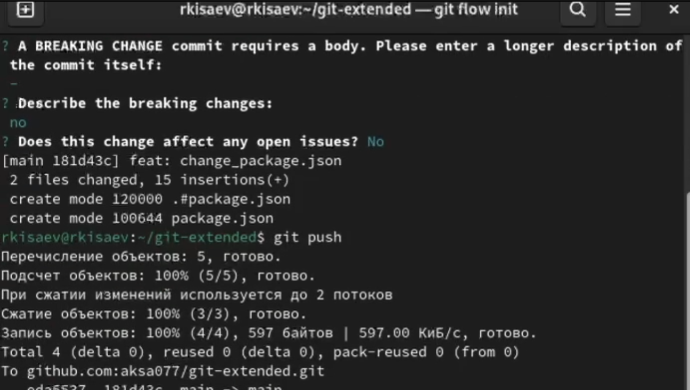{#fig:006 width=70%}

4. Инициализируем git-flow.
Префикс для ярлыков установим в v.
Загружаем весь репозиторий в хранилище.
Установим внешнюю ветку как вышестоящую для этой ветки, создадим релиз с версией 1.0.0

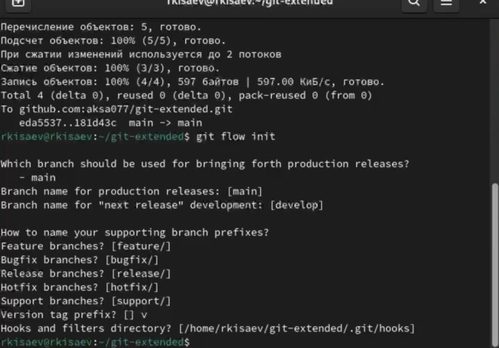{#fig:007 width=70%}

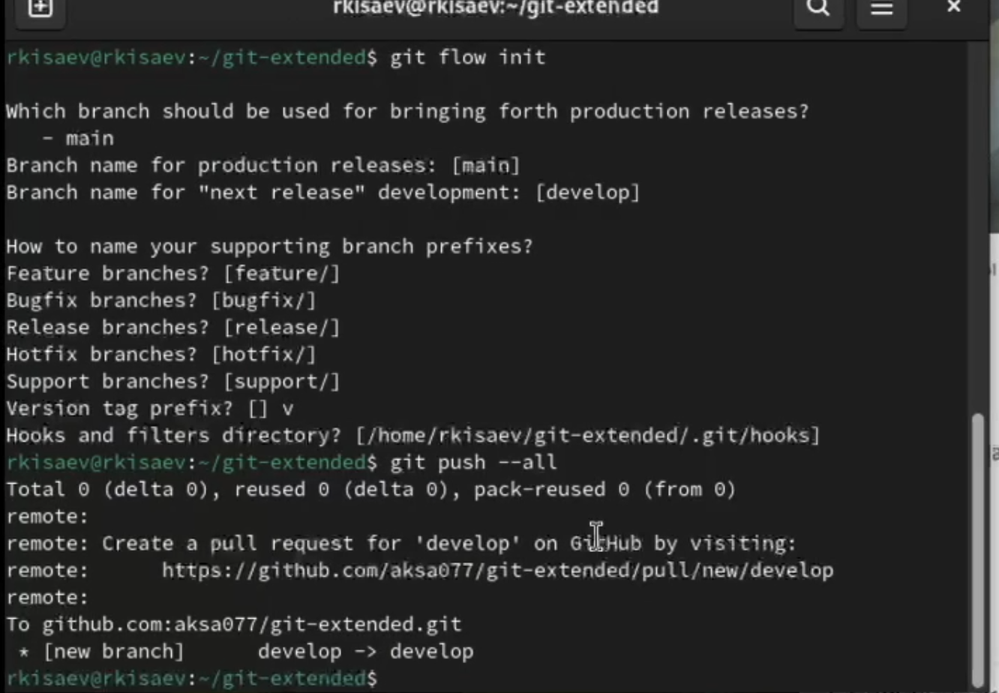{#fig:008 width=70%}

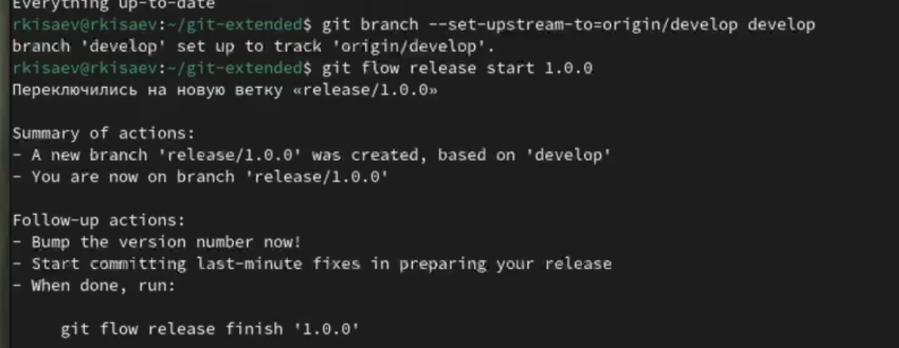{#fig:009 width=70%}

5. Создадим журнал изменений
Добавим журнал изменений в индекс
Зальем релизную ветку в основную
Отправим данные на Github. Для этого будем использовать утилиты работы с github

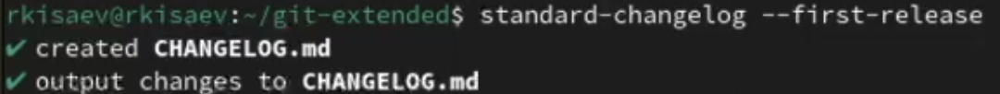{#fig:010 width=70%}

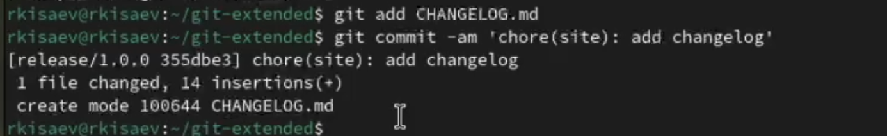{#fig:011 width=70%}

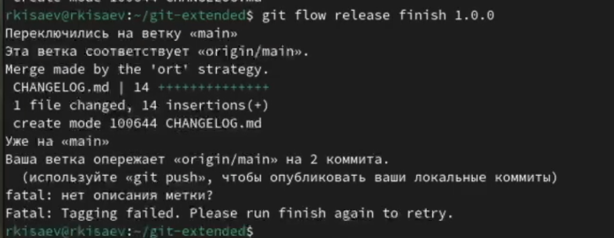{#fig:012 width=70%}

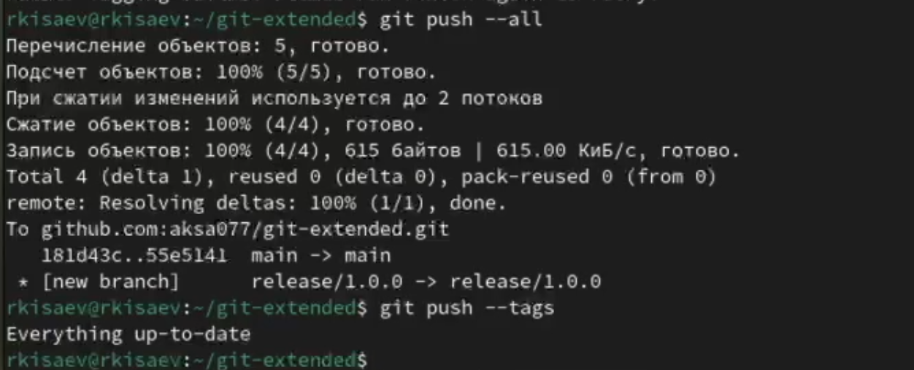{#fig:013 width=70%}

{#fig:014 width=70%}

6. Создадим ветку для новой функциональности. Следующим шагом следует объединить ветку feature_branch c develop

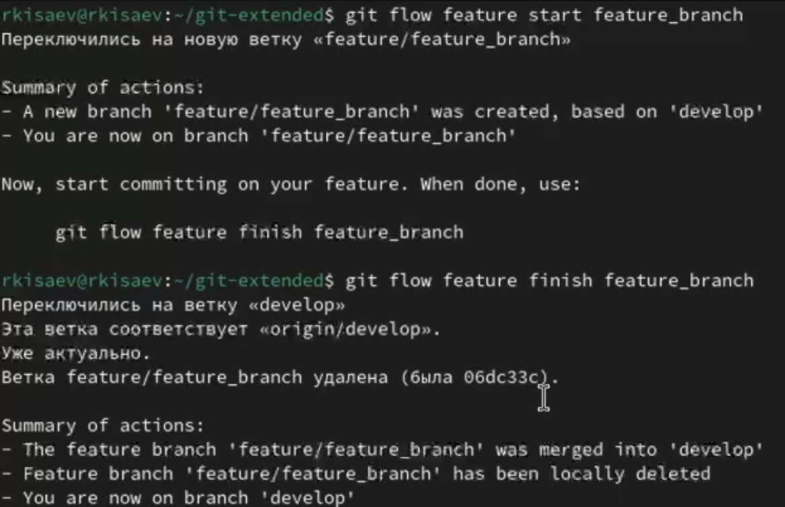{#fig:015 width=70%}

7. Создадим релиз с версией 1.2.3 
Обновим номер версии в файле package.json.Установим ее в 1.2.3.

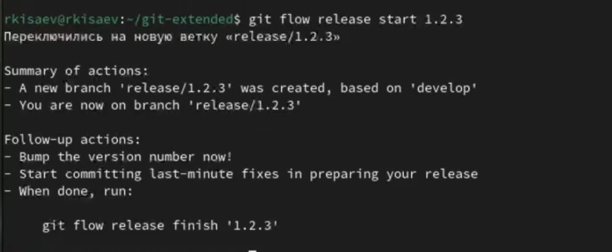{#fig:016 width=70%}

{#fig:017 width=70%}

8. Создадим журнал изменений
Добавим журнал изменений в индекс 
Зальем релизную ветку 
Отправим данные на Github
Создадим релиз на Github с комментарием из журнала изменений

{#fig:018 width=70%}

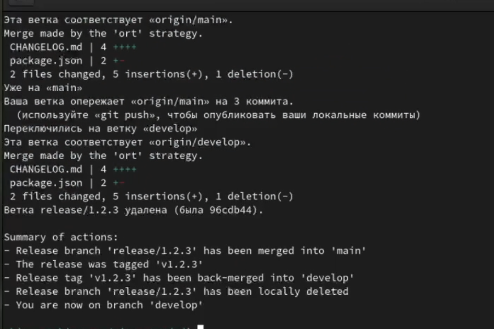{#fig:019 width=70%}

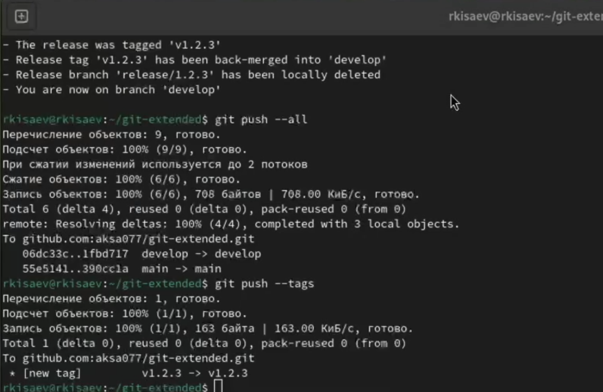{#fig:020 width=70%}

# Выводы

Мы получили навыки правильной работы с репозиториями git.

# Список литературы{.unnumbered}

::: {#refs}
:::
