---
## Front matter
lang: ru-RU
title: Отчет лабораторной работы
author:
  - Исаев Р. К.
institute:
  - Российский университет дружбы народов, Москва, Россия
  - Объединённый институт ядерных исследований, Дубна, Россия
date: 01 января 1970

## i18n babel
babel-lang: russian
babel-otherlangs: english

## Formatting pdf
toc: false
toc-title: Содержание
slide_level: 2
aspectratio: 169
section-titles: true
theme: metropolis
header-includes:
 - \metroset{progressbar=frametitle,sectionpage=progressbar,numbering=fraction}
---

# Информация

## Докладчик

:::::::::::::: {.columns align=center}
::: {.column width="70%"}

  * Исаев Рамазан Курбанович
  * Студент НКАБД 01-24
  * профессор кафедры прикладной информатики и теории вероятностей
  * Российский университет дружбы народов
  * git@github.com:aksa077/study_2024-2025_os-intro.git

:::
::: {.column width="30%"}

:::
::::::::::::::

# Выполнение лабораторной работы

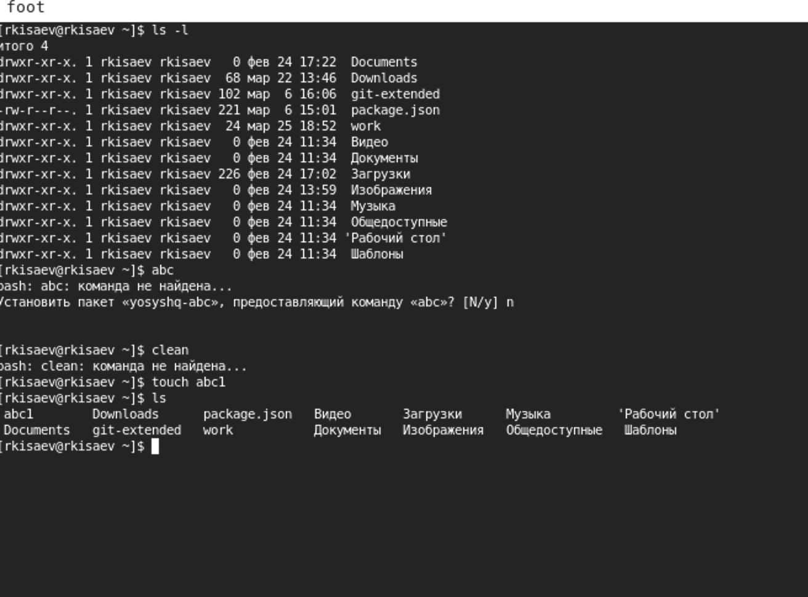{#fig:001 width=70%}

#

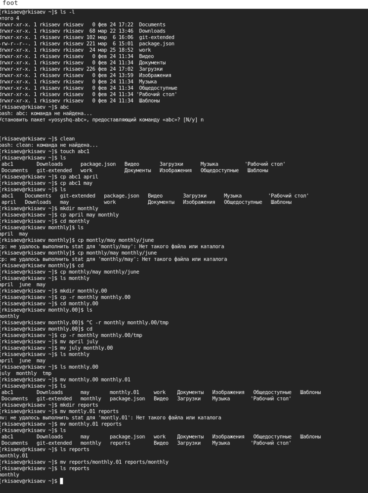{#fig:002 width=70%}

#

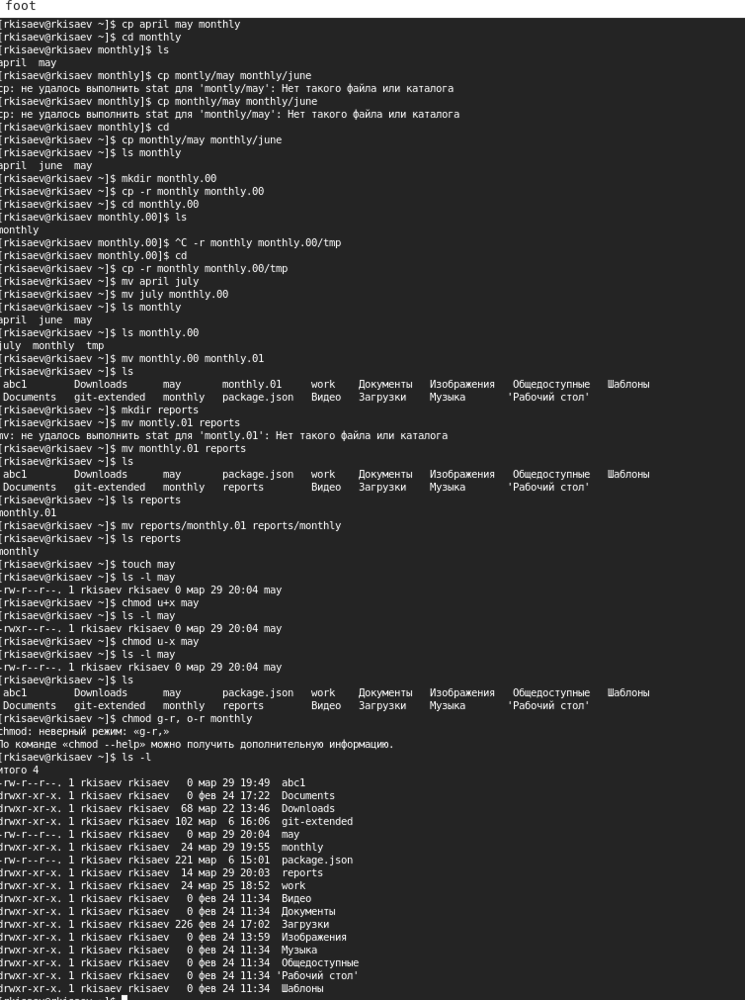{#fig:003 width=70%}

#

!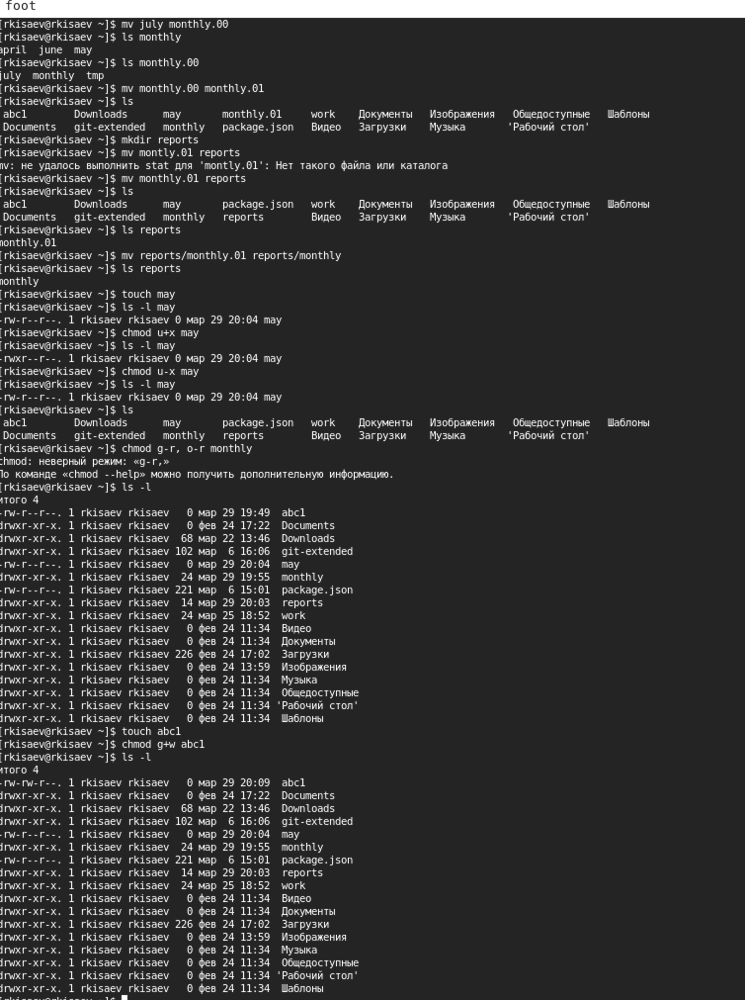{#fig:004 width=70%}

#

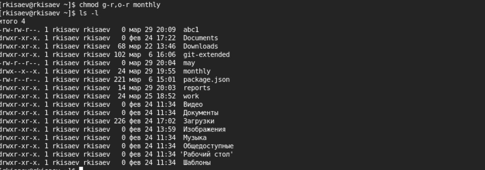{#fig:005 width=70%}

#

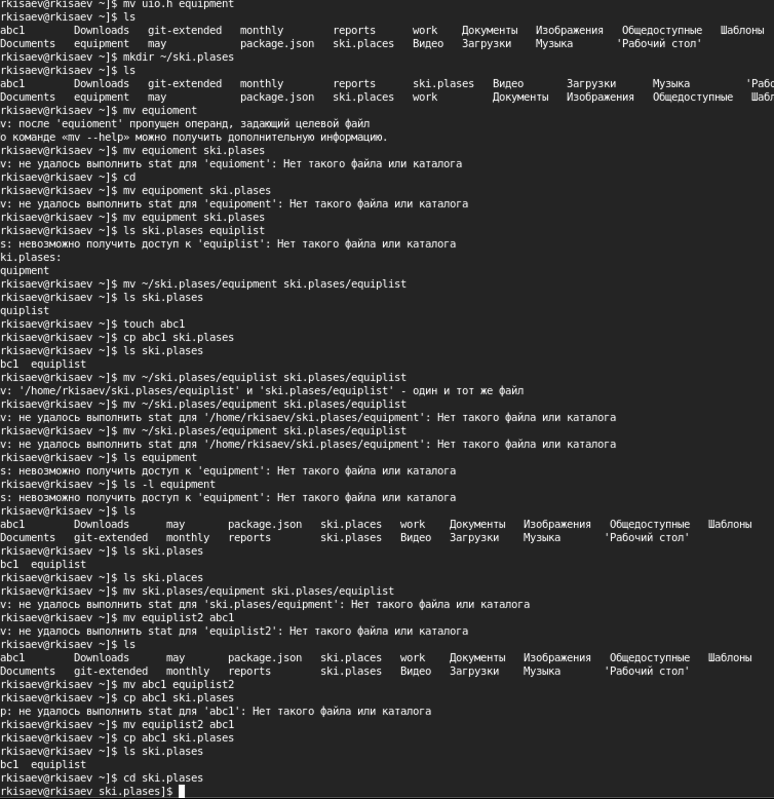{#fig:006 width=70%}

#

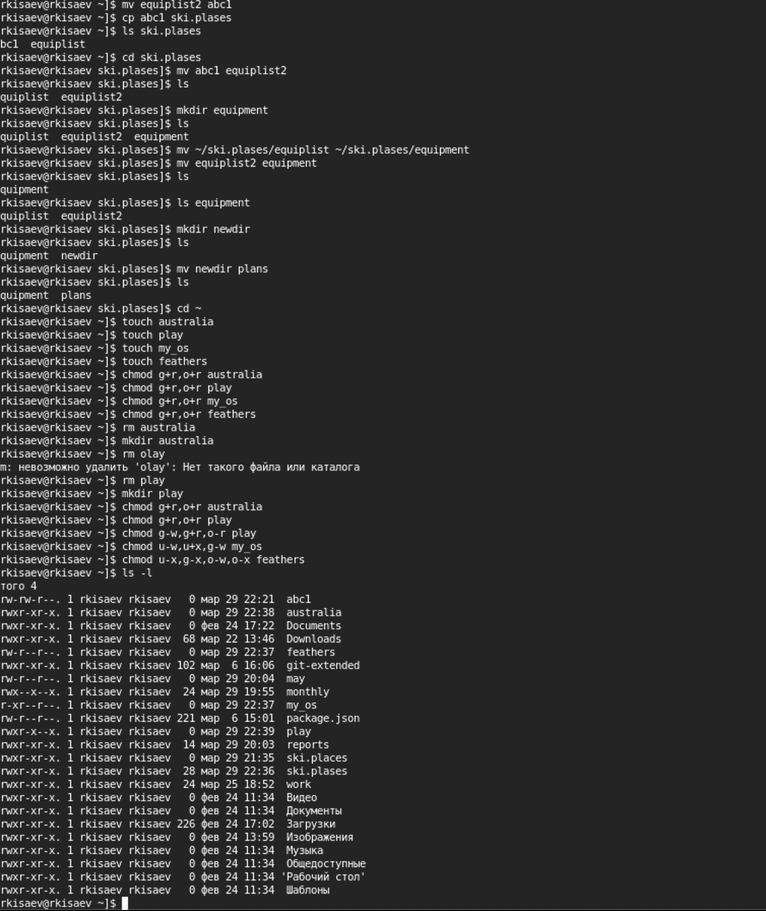{#fig:007 width=70%}

#

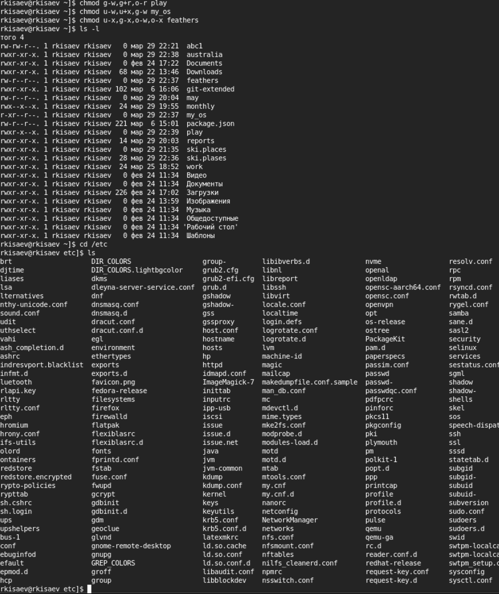{#fig:008 width=70%}

#

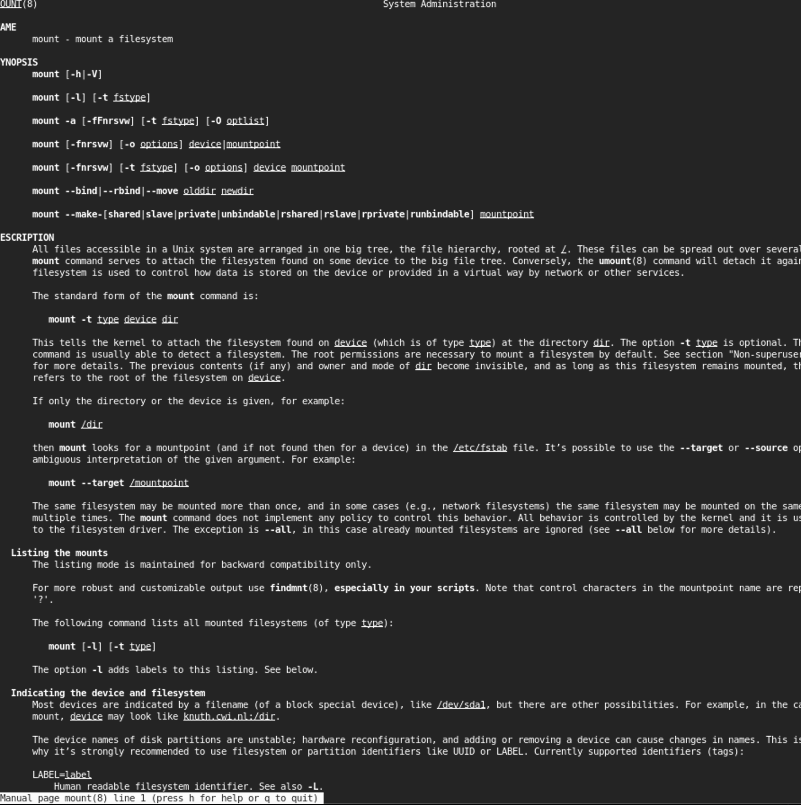{#fig:009 width=70%}

#

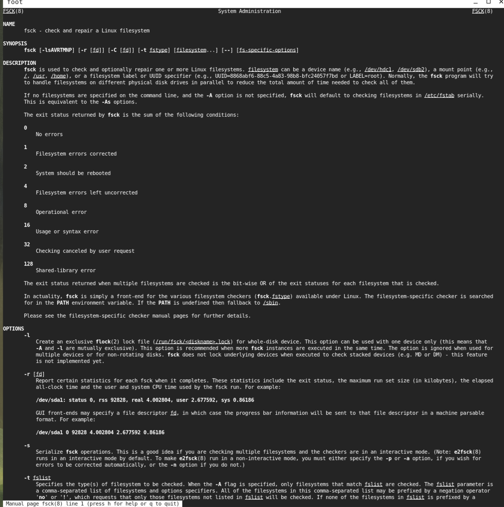{#fig:010 width=70%}

#

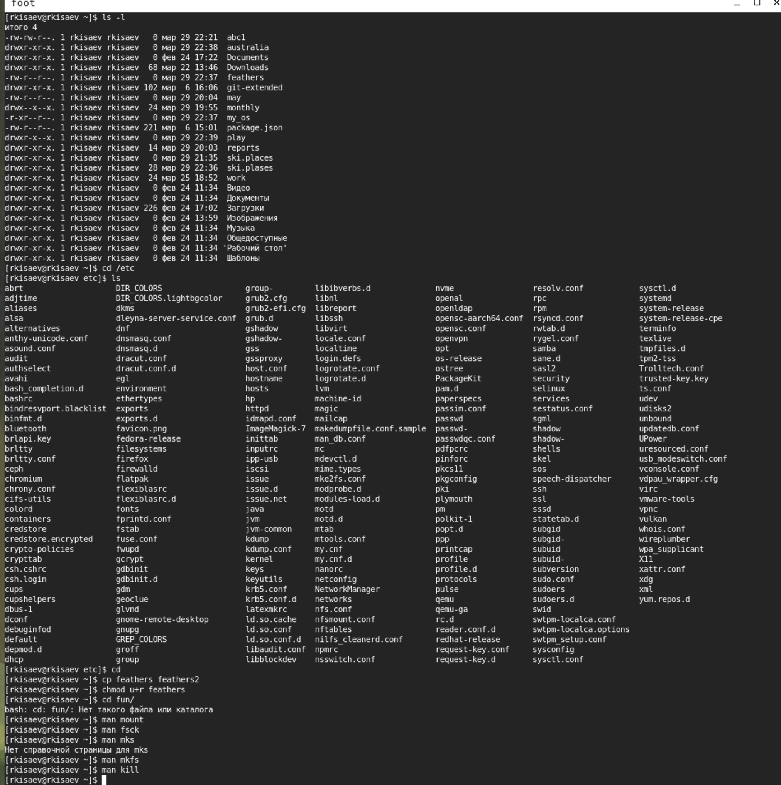{#fig:011 width=70%}

