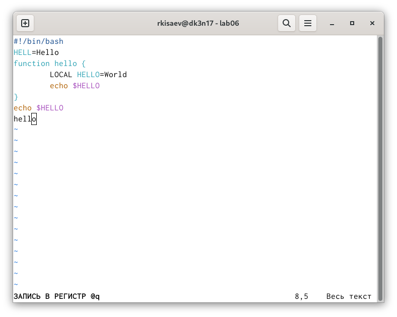
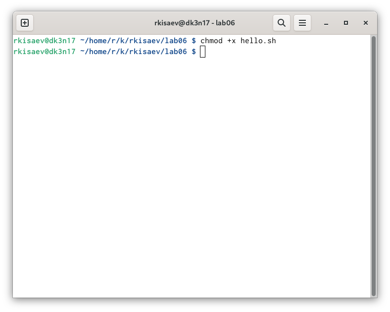
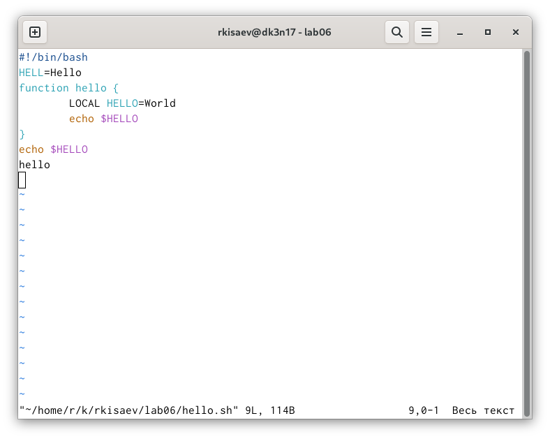

---
## Front matter
lang: ru-RU
title: Oтчёт по лабораторной работе 9
subtitle: Простейший шаблон
author:
  - Исаев P. К.
institute:
  - Российский университет дружбы народов, Москва, Россия
  - Объединённый институт ядерных исследований, Дубна, Россия
date: 01 января 1970

## i18n babel
babel-lang: russian
babel-otherlangs: english

## Formatting pdf
toc: false
toc-title: Содержание
slide_level: 2
aspectratio: 169
section-titles: true
theme: metropolis
header-includes:
 - \metroset{progressbar=frametitle,sectionpage=progressbar,numbering=fraction}
---

# Информация

## Докладчик

:::::::::::::: {.columns align=center}
::: {.column width="70%"}

  * Исаев Рамазан Курбанович
  * студент НКАБД 01-24
  * Российский университет дружбы народов
  * <https://github.com/aksa077/study_2024-2025_os-intro.git>

:::
::: {.column width="30%"}

# Цель работы

Создайте каталог с именем ~/work/os/lab06.
    Перейдите во вновь созданный каталог.
    Вызовите vi и создайте файл hello.sh
    Нажмите клавишу i и вводите следующий текст.
    Нажмите клавишу Esc для перехода в командный режим после завершения ввода текста.
    Нажмите : для перехода в режим последней строки и внизу вашего экрана появится приглашение в виде двоеточия.
    Нажмите w (записать) и q (выйти), а затем нажмите клавишу Enter для сохранения вашего текста и завершения работы.
    Сделайте файл исполняемым Задание 2. Редактирование существующего файла
    Вызовите vi на редактирование файла 1 vi ~/work/os/lab06/hello.sh
    Установите курсор в конец слова HELL второй строки.
    Перейдите в режим вставки и замените на HELLO. Нажмите Esc для возврата в команд- ный режим.
    Установите курсор на четвертую строку и сотрите слово LOCAL.
    Перейдите в режим вставки и наберите следующий текст: local, нажмите Esc для возврата в командный режим.
    Установите курсор на последней строке файла. Вставьте после неё строку, содержащую следующий текст: echo $HELLO.
    Нажмите Esc для перехода в командный режим.
    Удалите последнюю строку.
    Введите команду отмены изменений u для отмены последней команды.
    Введите символ : для перехода в режим последней строки. Запишите произведённые изменения и выйдите из vi.

# Задание

   1. Изучите информацию о mc, вызвав в командной строке man mc.
   2. Запустите из командной строки mc, изучите его структуру и меню.
   3. Выполните несколько операций в mc, используя управляющие клавиши (операции с панелями; выделение/отмена выделения файлов, копирование/перемещение фай- лов, получение информации о размере и правах доступа на файлы и/или каталоги и т.п.)
   4. Выполните основные кома2 months agoнды меню левой (или правой) панели. Оцените степень подробности вывода информации о файлах.
   5. Используя возможности подменю Файл , выполните: – просмотр содержимого текстового файла; – редактирование содержимого текстового файла (без сохранения результатов редактирования); – создание каталога; – копирование в файлов в созданный каталог.
   6. С помощью соответствующих средств подменю Команда осуществите: – поиск в файловой системе файла с заданными условиями (например, файла с расширением .c или .cpp, содержащего строку main); – выбор и повторение одной из предыдущих команд; – переход в домашний каталог; – анализ файла меню и файла расширений.
   7. Вызовите подменю Настройки . Освойте операции, определяющие структуру экрана mc (Full screen, Double Width, Show Hidden Files и т.д.)
   8. Создайте текстовой файл text.txt.
   9. Откройте этот файл с помощью встроенного в mc редактора.
   10. Вставьте в открытый файл небольшой фрагмент текста, скопированный из любого другого файла или Интернета.
   11. Проделайте с текстом следующие манипуляции, используя горячие клавиши: 4.1. Удалите строку текста. 4.2. Выделите фрагмент текста и скопируйте его на новую строку. 4.3. Выделите фрагмент текста и перенесите его на новую строку. 4.4. Сохраните файл. 4.5. Отмените последнее действие. 4.6. Перейдите в конец файла (нажав комбинацию клавиш) и напишите некоторый текст. 4.7. Перейдите в начало файла (нажав комбинацию клавиш) и напишите некоторый текст. 4.8. Сохраните и закройте файл.
   12. Откройте файл с исходным текстом на некотором языке программирования (напри- мер C или Java)2 months ago
   13.  Используя меню редактора, включите подсветку синтаксиса, если она не включена, или выключите, если она включена.

# Теоретическое введение

В большинстве дистрибутивов Linux в качестве текстового редактора по умолчанию устанавливается интерактивный экранный редактор vi (Visual display editor). Редактор vi имеет три режима работы: – командный режим — предназначен для ввода команд редактирования и навигации по редактируемому файлу; – режим вставки — предназначен для ввода содержания редактируемого файла; – режим последней (или командной) строки — используется для записи изменений в файл и выхода из редактора. Для вызова редактора vi необходимо указать команду vi и имя редактируемого файла: vi <имя_файла> При этом в случае отсутствия файла с указанным именем будет создан такой файл. Переход в командный режим осуществляется нажатием клавиши Esc . Для выхода из редактора vi необходимо перейти в режим последней строки: находясь в командном режиме, нажать Shift-; (по сути символ : — двоеточие), затем: – набрать символы wq, если перед выходом из редактора требуется записать изменения в файл; – набрать символ q (или q!), если требуется выйти из редактора без сохранения

# Выполнение лабораторной работы

Пишу код из листинга

{#fig:001 width=70%}

{#fig:002 width=70%}

{#fig:003 width=70%}

# Контрольные вопросы

   Дайте краткую характеристику режимам работы редактора vi. командный режим — предназначен для ввода команд редактирования и навигации по редактируемому файлу; режим вставки — предназначен для ввода содержания редактируемого файла; режим последней (или командной) строки — используется для записи изменений в файл и выхода из редактора.

    Как выйти из редактора, не сохраняя произведённые изменения? Можно нажимать символ q (или q!), если требуется выйти из редактора без сохранения.

    Назовите и дайте краткую характеристику командам позиционирования. 0 (ноль) — переход в начало строки; $ — переход в конец строки; G — переход в конец файла; n G — переход на строку с номером n.

    Что для редактора vi является словом? Редактор vi предполагает, что слово - это строка символов, которая может включать в себя буквы, цифры и символы подчеркивания.

    Каким образом из любого места редактируемого файла перейти в начало (конец) файла? С помощью G — переход в конец файла

    Назовите и дайте краткую характеристику основным группам команд редактирования. Вставка текста – а — вставить текст после курсора; – А — вставить текст в конец строки; – i — вставить текст перед курсором; – n i — вставить текст n раз; – I — вставить текст в начало строки. Вставка строки – о — вставить строку под курсором; – О — вставить строку над курсором. Удаление текста – x — удалить один символ в буфер; – d w — удалить одно слово в буфер; – d $ — удалить в буфер текст от курсора до конца строки; – d 0 — удалить в буфер текст от начала строки до позиции курсора; – d d — удалить в буфер одну строку; – n d d — удалить в буфер n строк. Отмена и повтор произведённых изменений – u — отменить последнее изменение; – . — повторить последнее изменение. Копирование текста в буфер – Y — скопировать строку в буфер; – n Y — скопировать n строк в буфер; – y w — скопировать слово в буфер. Вставка текста из буфера – p — вставить текст из буфера после курсора; – P — вставить текст из буфера перед курсором. Замена текста – c w — заменить слово; – n c w — заменить n слов; – c $ — заменить текст от курсора до конца строки; – r — заменить слово; – R — заменить текст. Поиск текста – / текст — произвести поиск вперёд по тексту указанной строки символов текст; – ? текст — произвести поиск назад по тексту указанной строки символов текст.

    Необходимо заполнить строку символами $. Каковы ваши действия? Перейти в режим вставки.

    Как отменить некорректное действие, связанное с процессом редактирования? С помощью u — отменить последнее изменение

    Назовите и дайте характеристику основным группам команд режима последней строки. Режим последней строки — используется для записи изменений в файл и выхода из редактора.

    Как определить, не перемещая курсора, позицию, в которой заканчивается строка? $ — переход в конец строки

    Выполните анализ опций редактора vi (сколько их, как узнать их назначение и т.д.). Опции редактора vi позволяют настроить рабочую среду. Для задания опций используется команда set (в режиме последней строки): – : set all — вывести полный список опций; – : set nu — вывести номера строк; – : set list — вывести невидимые символы; – : set ic — не учитывать при поиске, является ли символ прописным или строчным.

    Как определить режим работы редактора vi?

В редакторе vi есть два основных режима: командный режим и режим вставки. По умолчанию работа начинается в командном режиме. В режиме вставки клавиатура используется для набора текста. Для выхода в командный режим используется клавиша Esc или комбинация Ctrl + c .

    Переключение между режимами

    Esc для выхода в командный.
    i, a, o для входа в режим вставки.
    R для режима замены.
    : для последовательного режима.

# Выводы

Мы освоили основные возможности командной оболочки Midnight Commander. Приоб- рели навыки практической работы по просмотру каталогов и файлов; манипуляций с ними.

# Список литературы{.unnumbered}

::: {#refs}
:::

